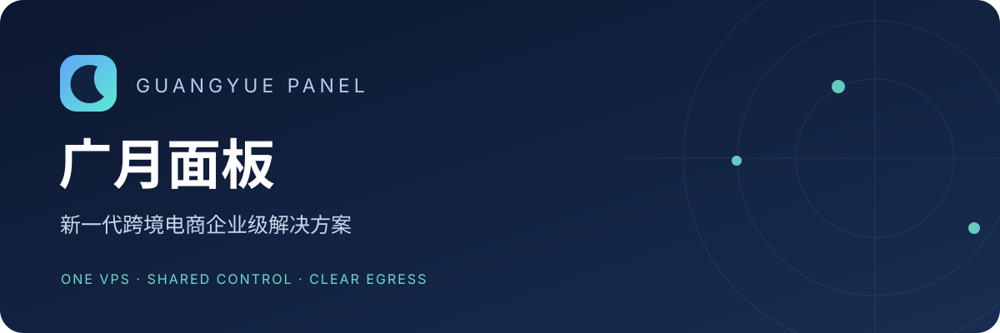
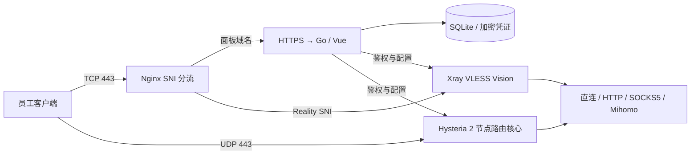

<div align="center">



# 广月面板 · Guangyue Panel

**新一代跨境电商企业级解决方案**

面向小型跨境电商团队的单 VPS 网络资源控制台：统一管理成员、节点、私有出口与独立公共代理池。

[English](README_EN.md) · [安装指南](docs/INSTALL.md) · [使用手册](docs/USER_GUIDE.md) · [Nginx 共存](docs/NGINX.md) · [运维与备份](docs/OPERATIONS.md)


</div>

## 项目定位

把服务器入口、出口 IP、员工订阅和可追溯的质量检测放进一个工作台，减少跨境团队配置和切换网络资源的重复工作。采用 Go + SQLite + Vue 3，无需 Redis、PostgreSQL 或 Docker；代理核心按需运行，适合单机部署。

“企业级”描述团队管理与运维场景。本版本是单 VPS 架构，不提供集群高可用、组织级租户隔离、计费或服务等级承诺。网络与账号合规由部署方和所使用平台的规则决定。

## 功能一览

| 模块 | 能力 |
| --- | --- |
| 仪表盘 | 用户、节点、流量、出口与服务状态，快速进入常用操作 |
| 节点管理 | VLESS Reality / Hysteria 2 多用户；保留两个默认直连节点；绑定出口创建新节点；批量操作 |
| 私有 IP 池 | 独立出口 / 订阅出口 / 订阅来源分栏；HTTP CONNECT、SOCKS5、单节点和订阅导入 |
| 来源管理 | 手动更新、删除，默认每日错峰自动更新；删除来源清理独占资源及绑定节点 |
| 公共 IP 池 | 独立来源、采集策略、黑名单、并发与时限预算、定时检查；自动维护独立节点 |
| 用户与订阅 | 管理员/成员、协议权限、有效期、共享流量配额；私有与公共订阅令牌分别管理 |
| 订阅体验 | Raw / Base64 / Mihomo，节点链接一键复制、二维码、成员可见质量报告 |
| IP 质量 | 多源地理位置、ASN、代理风险信号、公开页面可达性；保留来源、时间、未知和冲突 |
| DNS / IPv6 | 每节点 DNS 出口策略，安全 DoH 与 IPv6 允许/阻断选项 |
| 工作台 | 简易/专业模式、中文/English、主题、站内信、品牌与系统设置 |
| 运行模式 | 常规 / 无日志切换，与简易/专业界面模式独立 |
| 部署 | Nginx TCP 443 SNI 分流与 HY2 UDP 443；非特权服务、状态备份、升级回滚 |

> 流媒体或 AI 网站的公开页面可达，不等于账号登录、播放、支付或完整业务解锁。质量标签基于可核验的数据；不会把信息缺失强行标为“家宽”或“原生”。

## 快速开始

推荐 **Debian 12/13 或 Ubuntu 22.04/24.04、amd64、1 核 1 GiB 起步**。这是部署建议，不是内存占用保证；订阅规模、测速和代理核心会增加资源需求。

1. 准备 VPS 与 1～2 个域名，放行 TCP 80/443、UDP 443。最低可只用一个域名；推荐 `panel.example.com` 做面板、`node.example.com` 做节点。
2. 按[安装指南](docs/INSTALL.md)安装依赖、申请证书、获取固定版本包并校验 SHA256。
3. 运行只读预检查，通过后添加 `--apply` 安装。已有 Nginx 443 网站先完成[共存配置](docs/NGINX.md)。
4. 在服务器本地读取初始 `owner` 账号信息，登录后立即修改密码。创建成员、添加私有出口、绑定新节点、导入客户端订阅。

```bash
# 在已解压并校验的 release 目录执行；先按安装文档准备证书和核心。
sudo python3 deploy/install.py --bundle "$PWD" \
  --panel-domain panel.example.com --node-domain node.example.com \
  --cert /etc/letsencrypt/live/panel.example.com/fullchain.pem \
  --key /etc/letsencrypt/live/panel.example.com/privkey.pem
# 预检查通过后，使用相同参数加 --apply。
```

不提供未经检查的远程 `curl | bash`。安装器不会安装到已存在的广月状态目录，也不会自动停止其他项目。

## 文档导航

| 文档 | 适用场景 |
| --- | --- |
| [安装指南](docs/INSTALL.md) | DNS、证书、依赖、版本包、首次登录、卸载 |
| [使用手册](docs/USER_GUIDE.md) | 从创建用户到导入出口、发放订阅与排错 |
| [Nginx 共存](docs/NGINX.md) | 与现有 HTTPS 网站共用 TCP 443，保留自定义 SNI |
| [运维手册](docs/OPERATIONS.md) | 升级、回滚、备份恢复、续期、资源与连通性诊断 |
| [配置参考](docs/CONFIGURATION.md) | JSON 配置字段、端口、目录、运行模式 |
| [架构与边界](docs/ARCHITECTURE.md) | 数据流、权限、DNS、安全与资源设计 |
| [开发指南](CONTRIBUTING.md) | 本地开发、测试、构建、贡献流程 |
| [安全政策](SECURITY.md) | 漏洞报告、秘密与供应链管理 |
| [第三方许可](THIRD_PARTY_NOTICES.md) | 上游来源、修改说明与再分发约束 |
| [变更记录](CHANGELOG.md) | 版本变更 |
| [发布准备](docs/RELEASE.md) | 私有预备仓库、构建产物、公开前核对 |

## 架构



网站 HTTP/2 与 Hysteria 2 是不同概念。VLESS 使用 Reality + Vision + TCP，HY2 使用 QUIC/UDP；Linux BBR 不直接控制 HY2 的 QUIC 拥塞控制。

## 来源与致谢

本项目由 [fake-ui](https://github.com/wudi000888-svg/fake-ui) 2.3.1 的部署与控制台实践发展而来，当前发布的是重新整理的 Go/Vue 单机版，**不是原版 fake-ui 2.3.1 的重打包**。保留原项目 MIT 版权声明。

文档组织和专业控制台分区参考 [Sub2API](https://github.com/Wei-Shaw/sub2api)；没有复制其产品标识、截图或文案。感谢 Xray、Hysteria、Mihomo、Go、Vue 与 SQLite 生态。

面板源码使用 [MIT](LICENSE)。Hysteria 修改补丁使用 MIT；Xray 和 Mihomo 分别适用 MPL-2.0 与 GPL-3.0，详见第三方许可。
