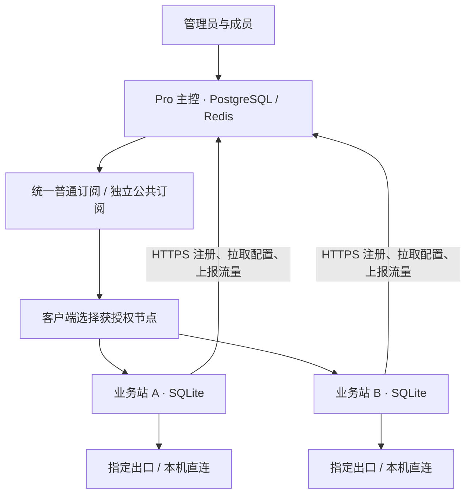

# 主控站与业务站

0.16.0 的 Pro 使用一个主控管理多个业务站。用户在主控登录、领取统一订阅；业务站负责所在 VPS 的 VLESS Reality、HY2、出口连接和检测。主控可以同时提供本机节点，因此已有单机 Pro 升级后仍保留原节点与订阅。



## 选择安装包

| Release asset | 用途 | 默认行为 |
| --- | --- | --- |
| `guangyue-panel-lite-0.19.2-linux-amd64.tar.gz` | 单 VPS 低资源部署 | Lite / SQLite / 单机管理 |
| `guangyue-panel-pro-0.19.2-linux-amd64.tar.gz` | 主控或业务站 | 默认主控；传 `--role business` 安装业务站 |

两个包共享核心业务代码，各自带有受校验的 `EDITION` 标记。安装器读取标记决定默认版本；`--edition` 可显式选择。升级默认沿用当前版本、角色与站点身份，不能通过普通升级把业务站改成主控。主控建议 2 核 2 GiB 起步；业务站建议 1 核 1 GiB，控制面沿用 Lite 的 48 MiB Go 内存目标与 160 MiB systemd 上限，不安装 PostgreSQL/Redis。总内存仍包含 Nginx、代理核心和操作系统。

## 安装主控

按[安装指南](INSTALL.md)准备域名、可信证书、Nginx、固定核心。下载 Pro 包，并按[版本指南](EDITIONS.md)创建独立 PostgreSQL / Redis。运行：

```bash
sudo python3 deploy/install.py --bundle "$PWD" --role controller --site-id control \
  --infrastructure-file /etc/guangyue-infrastructure.json \
  --panel-domain panel.example.com --node-domain node.example.com \
  --cert /etc/letsencrypt/live/panel.example.com/fullchain.pem \
  --key /etc/letsencrypt/live/panel.example.com/privkey.pem
# 只读检查通过后，原参数加 --apply。
```

已有 Pro 升级至 0.16.0 后自动作为主控，保留本机业务。主控管理上限为 64 个业务站，每站 2 个受保护默认直连节点、最多 14 个附加节点。现有主控用户上限仍为 100。不要为两台机器重复使用同一站点 ID 或复制状态、Reality 私钥。

## 注册业务站

1. 主控 → **群站管理 → 业务站 → 添加业务站**。填写唯一标识、名称、分组，下载注册 JSON。
2. 将注册文件通过可信通道保存到目标 VPS `/root/enrollment.json`，执行 `chmod 600 /root/enrollment.json`。文件不是命令脚本，不通过 URL 或 shell 参数传递令牌。
3. 目标 VPS 下载 **Pro** 包。按安装指南准备域名、证书、Nginx 和固定核心；无需运行基础设施安装器。最低只需一个域名同时用于节点与健康入口，推荐分开。
4. 执行以下只读预检查，通过后加 `--apply` 安装：

```bash
sudo python3 deploy/install.py --bundle "$PWD" --role business \
  --enrollment-file /root/enrollment.json \
  --panel-domain agent.example.com --node-domain edge.example.com \
  --cert /etc/letsencrypt/live/agent.example.com/fullchain.pem \
  --key /etc/letsencrypt/live/agent.example.com/privkey.pem
```

站点 ID 自动从注册文件读取。注册需要主控的有效 HTTPS 证书和公网地址，不支持自签证书、跳过校验或重定向。业务站主动访问主控 TCP 443；无需从主控连接业务站管理端口。代理入口仍需要 TCP/UDP 443，与每站 Nginx 兼容。

注册文件有效期 24 小时。主控固定首次上报的域名、站点 ID、Reality 公钥与 Short ID；首次同步后注册凭据失效，业务长期令牌加密保存在本站状态。业务站配置内原注册令牌随后已不可再次使用；安装源文件可删除。业务站没有管理员登录页或初始管理员密码，公网只开放 `/api/health`，管理必须在主控进行。

未注册且令牌过期，可在主控停用该记录、清空成员、删除后重新创建。已注册机器损坏应恢复原机器配套配置、密钥及最新状态，不要通过修改站点身份绕过计量水位；无法恢复时保留旧站点额度，停用旧机器后新建站点。当前不提供自动转移离线未结算额度的强制按钮。

## 分配成员、出口和节点

主控 **业务站 → 配置** 中选择成员、本站额度，选择 IP 池出口创建附加 VLESS/HY2 节点。每台业务站永远保留自己的两条默认直连；本机 IP 不进入 IP 池。出口配置更新会在下一次拉取时下发，出口删除或停用会撤下对应附加节点，恢复源出口后可重新下发。固定业务节点不会按测速自动更换出口。

- 共享出口允许多站使用；独占出口与其他业务站及主控本机绑定互斥。解除独占后需等待业务站确认新配置，才可释放已发出的旧绑定。
- 用户的 VLESS/HY2 权限、禁用状态、到期时间由主控决定。每站代理凭据从用户种子独立派生；不下发登录密码、主控订阅令牌或 Reality 私钥。
- 普通订阅只包含普通节点；公共出口创建的节点只进入公共订阅。订阅卡片标明站点，可直接复制单节点链接、查看二维码和报告。
- 节点可指定 Reality SNI 与 DNS 策略，目标必须兼容 TLS 1.3 / h2。默认启用出口 DNS 防护并阻断 IPv6；按出口能力配置 IPv6。单节点链接不携带完整客户端 DNS 策略，建议使用完整 Mihomo 订阅并开启客户端 DNS 接管。
- 所有业务站同步主控的常规/无日志运行模式；界面简易/专业模式独立。

业务站约每 25–34 秒拉取一次，失败退避最多 60 秒。主控展示配置版本是否确认，统一订阅只使用已确认版本；更新期间可能短暂隐藏待确认站点。成员账号停用后主控立即停止发放链接，已获取的客户端凭据需等待业务站同步撤销。

## 流量与离线授权

有限总配额采用预分配。例如用户总额 100 GiB，业务站 A 分配 30 GiB、B 分配 20 GiB，主控本机最多使用剩余的 50 GiB。每站配置值是该用户在本站的**累计上限**，并非本次新增流量；提高上限才增加可用额度。0 表示无限，仅总额度无限的用户可使用。

业务站定期报告累计上传、下载和协议流量。主控事务保存水位及增量，重复上报不重复计费；低于已确认水位的报告拒绝并停止续租。用户未消费的站点额度保持预留，撤销在业务站确认配置且报告包含所需全部水位后释放；离线不会自动重分配。

业务站使用最近成功配置的 15 分钟授权租约，断连期间允许继续服务；到期由本地周期检查停用用户并撤销核心授权；核心进程包装器另行监测租约，主控代理进程停止时也会在过期后终止核心连接。机器时钟须正常同步，检测及执行可能有数秒延迟。配额依赖周期采样与核心撤销，存在采样窗口内的超额，**不是实时交易计费或零超额保证**。主控故障不影响未过期租约内的业务连接。没有自动跨站出口故障切换、双主写入或数据库高可用承诺。

重装、恢复旧业务站备份可能导致计数回退；必须核对主控水位后恢复，不能清零继续续租。已退役用户的必要计量记录会保留，不受无日志模式清理。删除业务站必须先停用、清空成员，等待已确认撤销；删除记录不会卸载远端软件。

## 检测与报告

同一站点、相同出口的 VLESS / HY2 共享质量报告与标签；24 小时内成功报告复用。出口 IP 改变、配置改变或报告过期后重新检测。后台每轮最多检测一个到期资源，失败退避；不同站点的链路独立检测，不直接套用主控的检测结果。

主控业务站配置页支持下发质量检测和测速任务，业务站单个执行槽排队，进度在下一次心跳回传。质量按钮在报告有效期内复用报告；协议测速分别保存。报告会进入统一订阅的对应节点卡片。流媒体与 AI 标签只代表报告中列出的实际证据，不把页面可达等同于完整账号解锁。

## 运维与升级

主控按 Pro PostgreSQL 流程备份；业务站备份本机 `/etc/guangyue-personal.json`、完整 `/var/lib/guangyue`、证书来源与 Nginx 配置，保留权限并加密离机保存。停止业务服务后备份状态可避免 SQLite 与计量检查点不一致。业务站使用同一 Pro 包的 `deploy/upgrade.py`，自动按 SQLite 分支备份和回滚，不请求数据库基础设施。

```bash
curl -fsS http://127.0.0.1:19100/api/health
sudo systemctl status guangyue guangyue-xray guangyue-hy2
sudo python3 deploy/upgrade.py --bundle "$PWD"
# 检查通过后加 --apply。
```

健康状态应为 `edition=pro`、`role=business` 和注册的 `site_id`。健康接口证明进程运行，主控“已同步”证明配置已确认；最后仍需真实客户端分别验证 VLESS 和 HY2 的 TCP/UDP。保留升级恢复目录，不把注册文件、数据库、订阅 URI、二维码或密钥上传到 GitHub。

原 0.15 的联邦管理位于 **独立面板接入**，用于仍拥有独立用户库和订阅的旧站点；它与本节业务站模式分别管理，不会自动合并旧用户。
