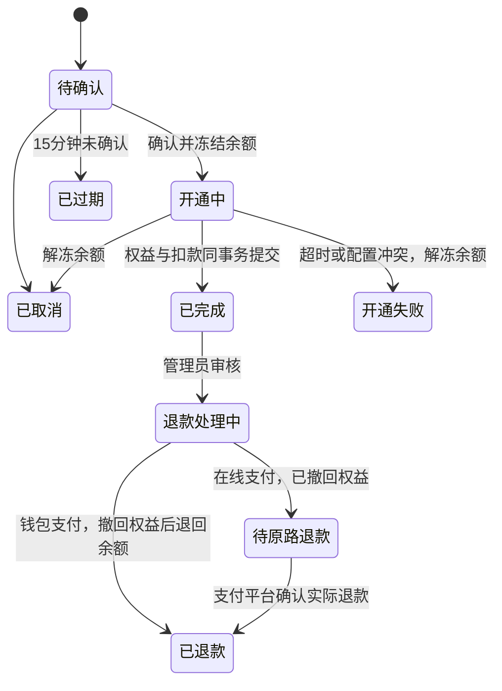

# 余额、兑换码、订单与工单

适用于 **0.21.0 及以后**，Lite 单机与 Pro 主控站。界面位于侧边栏“账户与服务”，这些核心入口在统一面板中始终可用。普通成员仅查看自己的余额、订单和工单；管理员可以管理所有成员。业务站继续负责代理连接与用量上报。

## 首次启用

1. 在“套餐管理”创建套餐，设置节点权限组、额度、周期、协议、有效期和“套餐价格 / 元”。价格保存为 CNY 分，修改套餐时会产生新的模板版本。
2. 在“购买套餐”新增销售配置，选择套餐版本、售价和上架状态。售价与权益形成快照，修改价格不会改写旧订单。
3. 在“系统设置 → 余额、兑换码与工单”开启“开放余额购买套餐”，输入管理员当前密码保存。
4. 通过兑换码或管理员人工入账给成员增加余额。余额可以购买套餐，无需配置支付平台。

## 在线支付

在“系统设置 → 交易与接入 → 在线支付”新增收款方式。新建默认停用，未填写真实商户配置不会开放收款。支持 **易支付 V1 MD5** 与 **Stripe Checkout**；通用 JSON Webhook 保留用于历史接入，不提供用户收银台。价格与余额均使用 CNY 整数分。

支付密钥仅写入站点 Vault 加密保存，不会从列表、编辑接口回显；编辑时密钥留空保留原值。停用阻止新支付，已有支付仍可回调处理；有历史的支付方式移除后归档，不删除历史收款。无历史的方式可直接删除。

### 易支付 V1

1. 新增“易支付”，填写**公网 HTTPS 网关地址**、商户号及商户密钥。网关需兼容 V1 `/submit.php` 与 MD5 签名；不直接支持只提供 V2 RSA 的接口。
2. 选择 `alipay`、`wxpay`、`qqpay` 或由收银台选择。同一网关的支付宝和微信可以分别创建两种支付方式，使用同一个商户号。
3. 保存后复制回调地址 `https://面板域名/api/payments/webhook/<支付方式 ID>`。回调支持 GET 或表单 POST，校验商户号、MD5 签名、交易状态与金额；缺少成功状态不会视为到账。
4. “接入检查”只验证网关 HTTPS 可达性，**不代表商户密钥或支付通道已验证**。使用服务商提供的测试通道验收后，再启用正式收款。

### Stripe Checkout

1. 新增“Stripe”，先填写 `sk_test_…` 或 `sk_live_…` Secret key，**保持停用并保存**。服务器通过 Stripe `/v1/account` 验证密钥并自动识别商户号，保存后显示专属回调地址。
2. 在 Stripe 控制台创建指向该回调地址的 Webhook，订阅以下事件：
   - `checkout.session.completed`
   - `checkout.session.async_payment_succeeded`
   - `refund.created`、`refund.updated`、`refund.failed`
3. 复制该 endpoint 的 `whsec_…` 签名密钥，编辑支付方式并填入。Secret key 与 Webhook 须属于同一测试/正式环境；填好签名密钥后才能启用。
4. 先在测试环境走通套餐付款、余额充值、重复通知与退款，再配置正式环境。接入检查确认 API 密钥和商户身份，Webhook 仍需通过 Stripe 测试事件或实际测试支付验收。

Stripe 使用其托管收银台；面板不收集银行卡信息。API 请求仅发送到固定 Stripe 域名，使用 HTTPS、超时与幂等键；回调使用原始请求体验签并检查时间戳和环境。浏览器回跳、打开支付页或点击“已付款”都不是到账依据。

### 在线充值与恢复

成员在“我的钱包 → 在线充值”填写金额并选择收款方式。充值只进入**当前登录账户**，管理员切换查看其他成员的钱包不会把自己的支付误充给该成员。充值确认后通过唯一收款记录与钱包分录在同一事务入账；页面展示充值进度并自动更新余额。

套餐在线付款直接支付该订单，不先充值到钱包，也不冻结钱包余额。支付窗口在点击时预先准备，受浏览器拦截时改为当前页面打开；可通过记录中的“继续支付”恢复已有收银台。网络失败重试沿用操作标识。返回页面只查询后台状态，不能由前端确认到账。

付款回调先持久化，再处理入账或开通。支付事件号/载荷防重之外，收款还按 **商户账号范围（account scope）+ 支付平台交易号** 设置数据库唯一约束：同一商户的支付宝/微信等多个方式收到同一交易，也只能入账一次。不同事件号、并发请求或多个面板进程不改变此约束。每次支付保存加密配置快照，修改或轮换商户配置不改写已创建的付款。

重启后后台继续处理已验证收款，不依赖用户回到页面或服务商再次回调。订单有效期内已接收到付款，恢复时即使超过原订单期限也会继续处理；真正过期、取消后收到付款，金额/币种不符、账号停用或权益冲突则保留实收记录并转退款。找不到对应订单的真实收款进入“待人工核对”，不会静默丢弃。升级还会恢复旧版已标记支付但未完成开通的记录。

### 外部退款

已开通套餐先在“订单管理”审核退款，系统撤回并结算权益后进入 `refund_pending`（待原路退款）。此时只表示权益已撤回，**资金尚未退回**。随后进入“在线支付 → 收款与退款处理”，选择具体**收款编号**：

- **Stripe**：提交原路退款请求。后台使用固定幂等键调用退款接口，只有 API、签名回调或后续查询确认 `succeeded` 才标记已退款；`pending`/`failed` 不会冒充退款完成。失败信息保留供管理员核对支付平台。
- **易支付**：先在商户后台完成真实退款，再填写实际退款交易凭据及说明，并确认已核实资金退回。面板记录该事实，不自动执行易支付退款，也不向站内钱包追加余额。
- **未知订单收款**：先人工核对支付平台账单及实际退款，再凭据确认。不能将未知收款直接分配给用户或开通套餐。

同一商户的退款凭据不能重复用于不同退款。外部付款不自动转为站内余额退款；用钱包付款的原有订单仍在撤回权益后退回钱包。所有退款操作要求管理员当前密码，操作后前端清除密码输入。

新安装默认关闭余额销售，默认开启兑换码充值和工单；升级保留已有设置。关闭新销售或支付方式不删除历史记录，也不影响已有订单的结算和售后。未提供商户密钥时，安装和升级验收不代表已完成真实收款验收。

## 兑换码

管理员进入“兑换码管理”，填写：

| 字段 | 规则 |
| --- | --- |
| 每个兑换码金额 | 人民币，最多两位小数，最低 0.01 元；单个金额与账户总余额最高 10 亿元 |
| 生成数量 | 每批 1–100 个，最多保留 10,000 个未用且未过期的有效码 |
| 兑换有效期 | 默认 30 天；可指定到期日期时间，也可选永久有效；有限期最长十年 |
| 批次备注 | 最多 500 字符，用于记录发放用途 |
| 管理员当前密码 | 生成及作废时校验 |

生成后立即保存或下载本批兑换码。完整码只在本次生成结果中显示，列表仅显示尾号、金额、有效期、批次和状态。返回丢失响应的原请求使用相同操作标识可以安全重试；一般列表不能找回明文。

勾选未使用的码，输入当前管理员密码并“确认作废”。作废后永久失效；已兑换的码不会倒扣成员余额。到期后禁止兑换；到期判定使用服务器时间，输入和显示使用浏览器当地时间。

成员在“账户余额 → 兑换码充值”输入完整兑换码，成功后一次性计入**当前登录账号**。同一码只能成功兑换一次，并发兑换、网络重试与重复提交不会重复入账。每个账号每个十分钟窗口最多尝试 10 次，重放已成功的原请求不再次消耗兑换次数。

兑换码使用 128 位随机值；数据库保存校验哈希和尾号。为处理生成响应丢失，原操作结果使用站点主密钥加密保存。备份包含该密钥，须按完整业务数据管理。

## 余额与资金流水

从 0.21.2 起，顶部直接显示当前登录账号的可用余额，点击可进入“账户余额”。悬停或通过辅助阅读标签可查看冻结余额；手机端同样常驻显示可用余额。管理员在钱包页选择其他成员时，顶部仍显示管理员自己的余额。兑换、人工调整和订单操作后自动刷新，可见页面每 30 秒同步一次，重新进入页面也会同步。加载或读取失败显示“—”，不会把读取失败当成零余额。切换至独立站点的远程管理界面时隐藏本站余额。

- 可用余额可消费；确认订单后金额转为冻结余额，开通成功才转为消费。
- 管理员登录后的 owner 会话即可人工入账、赠送或扣减，无需再次输入账户密码；仍必须填写原因，且每次操作都写入不可变资金流水并经过账目校验。普通成员不能调整余额。
- 所有金额以整数“分”保存，成对资金分录与余额在同一数据库事务中写入。记录包含操作者、原因、业务单号和交易后余额。
- 资金流水为站内记账记录，人工入账不表示系统核实了外部收款。在线充值以验签收款为依据；不提供提现、转账、透支或自动续费。
- 节点倍率影响配额消耗，不按流量再次扣人民币余额。

启动时核对账本、账户汇总和冻结订单；校验失败会阻止资金写入。每次资金变更再次核对上一个钱包记录。不要直接修改数据库中的余额或删除资金分录。

## 订单与退款

创建订单即生成唯一 `GYO-` 单号，保存用户、售价、套餐版本与权益快照。订单 15 分钟内有效，创建时不扣款。

```mermaid
stateDiagram-v2
  [*] --> 待确认
  待确认 --> 开通中: 确认并冻结余额
  待确认 --> 已取消
  待确认 --> 已过期: 15分钟未确认
  开通中 --> 已完成: 权益与扣款同事务提交
  开通中 --> 已取消: 解冻余额
  开通中 --> 开通失败: 超时或配置冲突，解冻余额
  已完成 --> 退款处理中: 管理员审核
  退款处理中 --> 已退款: 钱包支付，撤回权益后退回余额
  退款处理中 --> 待原路退款: 在线支付，已撤回权益
  待原路退款 --> 已退款: 支付平台确认实际退款
```

支持首次开通、到期后重新开通，以及有效期内**相同套餐相同版本续费**。续费只延长到期时间，保留当前周期已用流量和周期边界。永久权益无需续费。本版不提供按剩余价值折算的跨套餐升降级。

新开通会在旧连接及业务站授权结算完成后创建新配额周期，累计实际流量保留。开通状态保存在数据库中，进程重启后继续处理，重试最长间隔 60 秒；确认后超过 30 分钟未完成时，钱包付款自动解冻，在线付款转待原路退款。通知失败不会撤销成功的资金操作。

已完成订单可以由管理员审核整单退款。系统先停止对应权益并结算旧连接；钱包支付退回余额，在线支付进入待原路退款并按上文处理，撤权未完成时不提前退款。首购退款终止该订单开通的权益，不恢复此前免费权益；续费退款恢复续费前到期时间，已用流量保留。若后续购买或管理员操作已改变权益版本，禁止自动退款，应先核对历史。无自动部分退款。

订单处理期间，相关用户的手工权益修改和业务站成员配置修改受互斥保护。商品下架和已成交快照独立；确认之前归档套餐或暂停销售会拒绝确认。

## 工单与图片

登录成员可以创建工单、回复、关闭，以及在关闭/解决后七天内重开。到期或配额耗尽不会禁止登录门户；停用账号不能登录。类别包括账户余额、订单套餐、节点线路、用量及其他。可以关联自己的订单和有权使用的本站/业务站节点，历史工单保留资源名称，即使节点后来删除。

管理员可查看所有工单、设置普通/紧急优先级、处理状态，并添加**仅管理员可见的内部备注和图片**。成员不能读取他人的工单或内部附件。工单通知进入站内信，删除站内信不影响工单原文。

| 限制 | 默认值 |
| --- | --- |
| 图片格式 | PNG / JPG / JPEG；拒绝 GIF、WebP、SVG、压缩包及 APNG 动图 |
| 每张图片 | 原始和处理后均不超过 2 MiB |
| 像素 | 单边最多 4096，合计最多 800 万像素 |
| 每次提交 | 最多 3 张图，正文最多 4000 字符，标题最多 120 字符 |
| 图片容量 | 每工单 20 MiB、每用户 100 MiB；Lite 总计 1 GiB、Pro 主控总计 5 GiB |
| 上传频率 | 每账号每小时窗口最多尝试 30 次，包括失败上传 |
| 工单频率 | 成员最多 5 个未关闭工单、每 24 小时 10 个新工单、每小时 20 条回复 |
| 未提交图片 | 15 分钟后失效并清理 |
| 关闭后的图片 | 保留 90 天；重开后重新计时 |

服务端检查扩展名、MIME、真实解码格式、尺寸及内容，剥离元数据并重新编码，JPEG 保留正确方向。处理使用单个受内存、CPU和时间限制的临时子进程；处理队列忙时直接提示重试，不新增常驻服务。磁盘剩余不足 1 GiB 或 10% 时拒绝图片，文字工单仍可用。

附件按单张加密保存于 SQL，所属用户、工单绑定和内容随数据库快照一起备份，避免文件与数据记录不一致。图片只通过鉴权接口读取，不提供公开静态地址。容量限制以处理后图片大小计算，数据库加密编码及历史数据另有开销。文字工单和财务历史长期保留，本版不自动删除文字。

## 群站、运行模式与备份

- **Pro 主控站**保存全局用户的钱包、兑换码、订单和工单。一个跨站套餐只记一笔订单，不在每个业务站重复收费。
- 业务站不保存资金、兑换码和附件，不开放这些 API。独立站点远程代理接口也不能转发账户服务；在主控自身的“账户与服务”操作。
- 已分配业务站需支持套餐权限与配额周期（协议 2）。旧协议站点需要先升级。从 0.30.13 起，原有预留额度不会阻止套餐上架、购买或续期。更换套餐由系统结算旧授权后重新计算子站额度，无需手动调整；用户套餐额度用尽时撤销该用户节点授权并移出订阅，不删除节点组成员，也不影响其他用户。
- 离线业务站的旧授权须完成撤回/结算后才发新周期，不凭空重新分配预算。新权益提交后节点实际可用性以业务站同步状态为准。
- 无日志模式保留必要资金、订单、工单和授权业务数据；与统一面板界面独立。
- 有资金或工单历史的用户删除会转为归档；需先处理未完成订单并清算可用/冻结余额。用户 ID 和历史记录不复用，归档账号只读。
- 完整升级备份与便携快照包含新增数据和加密附件；SQLite 与 PostgreSQL 迁移会检查账本。备份/恢复采用逐行及文件流式读写，数据库恢复上限为 8 GiB，需预留足够备份磁盘空间。
- 账户服务始于 `005_commerce.sql`；本次支付集成增加 `013_payment_integration.sql`，包含唯一收款和退款记录，备份/迁移会完整保留。已有数据不能直接交给不支持当前迁移的旧程序。面板回退保护会拒绝不兼容版本。需要回到旧版时必须恢复匹配的完整旧备份，备份之后的交易不能自动还原。

安装参见[安装指南](INSTALL.md)，备份和回退参见[运维说明](OPERATIONS.md)。不要将真实兑换码、数据库、配置或主密钥上传到公开仓库或工单。
