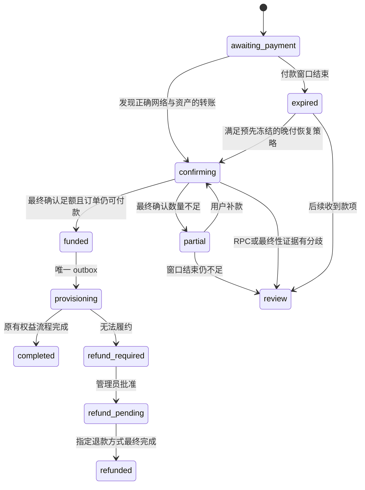

# 加密货币支付实施设计

状态：**0.37.0 实现钱包、订单自动地址、Ethereum/BSC 白名单资产最终确认收款、套餐开通与管理员发起的热钱包资产提取。** L2 批次证明、外部签名服务、自动链上退款、自动汇率和跨链桥仍是后续设计。

资料核验日期：2026-10-08。实际操作和交付边界见[钱包管理](CRYPTO_WALLETS.md)、[订单与归集](CRYPTO_TREASURY.md)和[当前接口](projects/crypto-payments/CONTRACTS.md)。本文保留完整长期设计，其中逐链 L1 证明、隔离签名器、链上退款、晚付恢复和拟议 SQL 不能视为当前实现。工程验收使用隔离 RPC 与无价值 EVM，不接入用户真实钱包或广播主网交易。

当前切片使用人民币手动汇率、每单独立且永久保留的地址、链事件唯一键、共用订单锁、持久化 receipt 和现有履约 worker。Ethereum/BSC 以双 RPC `finalized` 规范链和完整 receipt 为准；L2 候选网络不能仅靠管理员勾选绕过 L1 证据要求。Gas/归集签名使用固定的 go-ethereum 库，构建来源见[签名构建](CRYPTO_BUILD.md)。

评审修订日期：2026-10-08。本稿已补充交易所付款精度与等待窗口、逐订单地址的归集成本、完整规范 receipt 的重组处理、退款转出凭证唯一归属、收款后的履约准入检查，以及钱包连接与 HD 自动派生的能力边界和配置流程。

项目入口：[项目文档与施工任务](projects/crypto-payments/README.md)、[接口与交互契约](projects/crypto-payments/CONTRACTS.md)、[验证与交付计划](projects/crypto-payments/VALIDATION.md)。项目文档保留 0.35.1 支付内核审计，并单列当前钱包交付；资金规则以本文为准，已实现的钱包接口与拟议付款接口分别标注。

## 1. 产品范围与默认选择

用户从已有套餐订单选择“加密货币”，再选择**资产与网络**，获得专属收款地址、应付数量、二维码和支付截止时间。系统依次显示“等待付款 → 已发现转账 → 等待网络确认 → 已收款，正在开通 → 已开通”。管理员从现有交易模块查看异常款、退款与链同步状态，不新增一套与订单割裂的管理中心。

首批链适配器覆盖 Ethereum `1`、BNB Smart Chain `56`、Arbitrum One `42161`、OP Mainnet `10`、Base `8453`。支持范围以第 3 节**精确合约白名单**为准，不按币名自动识别，不承诺每条链都存在发行方原生 USDT。Base 首批只开放原生 USDC。

实施默认值：

- 加密货币套餐支付在新安装和升级中均保持未启用。管理员可管理钱包和手动地址，但这些不是订单地址；成员不展示加密付款入口、收款成功标记或模拟付款二维码。
- 推荐低手续费网络的原生 USDC；Ethereum USDT/USDC 可选；Binance-Peg 与 USDT0 必须显示资产形态，分别启用。
- 使用每张 invoice 独立、永不复用的收款地址。报价用精确数量，不通过金额尾数猜订单。
- 只接受白名单 ERC-20 的最终确认 `Transfer`；原生 ETH/BNB 仅用于手续费，不是本期支付资产。
- 先实现“直接支付已有订单”，不顺带开放加密货币钱包充值、兑换、提现、跨链桥或自动原路退款。
- 默认达到链的最终确认条件后才开通套餐。交易广播成功、钱包截图、浏览器回跳、单个 Webhook、`latest` 或 mempool 均不是收款凭证。

首次配置向导优先推荐 **Base 原生 USDC** 和 **BNB Smart Chain 的 Binance-Peg USDT**，管理员仍须分别审核启用；Ethereum USDT/USDC、Arbitrum/OP 作为可选扩展。BNB 选项必须保留 Binance-Peg 标签。低 Gas 成本与支付最终确认速度分开说明，不承诺 L2 秒级开通。零元套餐沿用免费开通流程，不分配收款地址。

## 2. 与现有系统衔接

当前代码入口可作为重构锚点，但实施时应以最新版本重新核对：

| 现有对象 | 当前用途 | 本设计的处理 |
| --- | --- | --- |
| `commerce_orders`、`commerce_orders.go` | 固定售价与套餐快照，管理开通、结算旧授权和退款 | 保留权益流程；将付款状态与权益状态分离，所有支付渠道竞争同一笔订单的资金归属 |
| `payment_providers` | 独立配置，敏感配置由 Vault 加密 | 新增未来的 `evm_crypto` 适配器；链和资产配置规范化，不能把钱包助记词塞进 `secret` |
| `payment_attempts` | 渠道尝试、CNY 分金额、幂等请求 | 保留 CNY 订单金额；一笔 crypto attempt 对应一张 invoice，不存 token 原始数量到 `amount INTEGER` |
| `payment_events` | 按提供商事件号、载荷哈希去重 | 仅作为通知入口审计；另建链事件事实表，不能用提供商 ID 或载荷哈希代替链事件唯一性 |
| `payment_receipts`、`payment_receipts.go` | 新支付内核按商户账号域和上游交易号建立唯一收款，持久恢复 | 复用“事件与资金事实分离”的原则；crypto 的事实身份改为链事件键，不按多个网关拆出多份收款 |
| `payment_refunds`、`payment_refunds.go` | 独立退款责任、审批、平台处理结果 | 延伸为按精确链资产和原子数量退款；链最终确认不能用平台 API 返回成功替代 |
| `money_transactions.event_key`、`postMoney` | 站内 CNY 余额与成对分录，同事务记账 | 保持现有余额语义；新增分资产外部收款账本，真正变更站内余额时才调用 `postMoney` |
| `commerce_outbox` | 已有表结构，尚无生产入队或消费者 | 实现发货队列、业务唯一键和消费幂等表，重启和重复消费不能再次开通 |
| `confirmExternalOrder` | 经 HTTP 测试请求调用订单动作 | 提取可在业务事务中使用的付款归属服务；不要让“收款提交后再调一次 handler”成为唯一发货保障 |

必须保持或补齐的集成边界；0.35.1 的法币支付内核已有部分对应能力，实施 crypto 时应复用并验收：

1. 将订单级唯一付款归属用于**余额、易支付、其他 Webhook 和 crypto 所有渠道**。只在 crypto 表里去重，无法阻止用户在另一渠道同时支付同一订单。
2. 外部款不冻结站内余额。当前 `validateCommerce` 已将冻结订单核对限制为未绑定在线支付的 `provisioning` 订单，crypto 必须保持这一语义，不能要求外部支付订单也有对应 `held`。
3. 不能把链上 `uint256` 数量强转成 Go `int64`、SQL `INTEGER` 或 JavaScript `Number`。现有账本是 CNY 分，并非多币账本。
4. 取消订单、报价到期或关闭渠道不会抹去已收到的款项。继续使用新支付内核“先记录唯一收款、再判断履约或退款”的原则，不能恢复成“已到期就拒绝回调”。
5. 必须保留站内余额退款和外部收款退款的区别。crypto 先选择退款方式并登记唯一退款责任，不能既退余额又发币；未广播、未最终确认的链上退款不能标记“已退款”。

## 3. 网络与资产白名单

### 3.1 首批候选清单

以下是本次从发行方、项目方和 BNB Chain 官方资料核验出的**设计候选**。所有条目初始停用。`decimals` 是启动验收的预期值，本文没有通过真实 RPC 验证链上返回值；正式启用时必须核对。

| Chain ID / 网络 | 前台必须显示的名称 | Token 合约地址 | 预期 decimals | 发行 / 跨链形态 | 来源 |
| --- | --- | --- | --- | --- | --- |
| `1` Ethereum | USDT · Ethereum | `0xdAC17F958D2ee523a2206206994597C13D831ec7` | 6 | Tether 在 Ethereum 发行的 USD₮ | [Tether 支持协议][tether] |
| `1` Ethereum | USDC · Ethereum | `0xA0b86991c6218b36c1d19D4a2e9Eb0cE3606eB48` | 6 | Circle 原生 USDC | [Circle 合约表][circle] |
| `56` BNB Smart Chain | USDT · BNB Smart Chain · Binance-Peg | `0x55d398326f99059fF775485246999027B3197955` | **18** | Binance-Peg USDT，非本设计认定的 Tether 原生发行 | [BNB 官方资产目录][bnb-assets]、[Binance 抵押资产页][binance-peg] |
| `56` BNB Smart Chain | USDC · BNB Smart Chain · Binance-Peg | `0x8AC76a51cc950d9822D68b83fE1Ad97B32Cd580d` | **18** | Binance-Peg USDC，非 Circle 原生 USDC | [BNB 官方资产目录][bnb-assets]、[Binance 抵押资产页][binance-peg] |
| `42161` Arbitrum One | USDC · Arbitrum One | `0xaf88d065e77c8cC2239327C5EDb3A432268e5831` | 6 | Circle 原生 USDC | [Circle 合约表][circle] |
| `42161` Arbitrum One | USDT0 · Arbitrum One | `0xFd086bC7CD5C481DCC9C85ebE478A1C0b69FCbb9` | 6 | USDT0；该地址列于项目部署表，不能再并列创建一个“旧 USDT”重复资产 | [USDT0 部署][usdt0-deploy]、[部署 API][usdt0-api] |
| `10` OP Mainnet | USDC · OP Mainnet | `0x0b2C639c533813f4Aa9D7837CAf62653d097Ff85` | 6 | Circle 原生 USDC | [Circle 合约表][circle] |
| `10` OP Mainnet | USDT0 · OP Mainnet | `0x01bFF41798a0BcF287b996046Ca68b395DbC1071` | 6 | USDT0 OFT 体系，不等同于历史桥接 USDT | [USDT0 部署][usdt0-deploy]、[部署 API][usdt0-api] |
| `8453` Base | USDC · Base | `0x833589fCD6eDb6E08f4c7C32D4f71b54bdA02913` | 6 | Circle 原生 USDC | [Circle 合约表][circle] |

**明确不纳入首批：**

- Base 上任意名为 USDT、USDT0 或类似名称的代币：本次核验的 Tether/USDT0 官方清单没有为 Base 提供可批准的 USD₮/USDT0 Token 条目，因此不填写推测地址，不显示支付选项。
- Arbitrum 的 USDC.e、OP 的历史桥接 USDC、Base 的 USDbC，以及 OP 的旧桥接 USDT：与表中资产不同，默认不接受；若未来确需支持，必须新增明确的桥接资产 ID、官方桥映射来源和审核记录。
- BEP-2、TRC-20、其他同名代币、测试网代币，以及 USDT0 的 OFT Adapter、OFT、Safe、Composer 地址：这些不是本表中的 ERC-20 收款 Token 合约。

Tether 的支持协议页可能列出“BNB Smart Chain”，但本次该段给的是 **XAU₮** 合约，不能据此推导 BNB 上常见的 USDT 就是 Tether 原生发行。USDT0 官方 API 的 `native` 分类表示该项目自己的部署分类，也不能直接转换为“发行方在该链原生发行”的产品文案。USDT0 有锁定 / 销毁 / 铸造及跨链消息验证信任假设；[项目架构说明][usdt0-model]应作为管理员启用前的资产说明。

### 3.2 白名单的持久化与启用检查

资产身份为 `(network_namespace, chain_id, token_contract_bytes20)`。`symbol` 只是展示，地址按 20 字节或统一小写规范化用于比较，前台用校验和地址展示。主网和测试环境数据库、密钥域、invoice ID 前缀完全隔离。

资产配置记录 `asset_id / revision / chain_id / contract / decimals / representation / issuer / source_urls / verified_at / approved_by / enabled_new_invoices`。链配置记录 Chain ID、创世区块 hash、L1 Chain ID、RPC 供应商标识和最终确认策略版本。合约迁移不能覆盖旧记录，旧 invoice 永久引用自己的资产、报价及策略快照。

正式启用向导必须执行：

1. 两个独立 RPC 供应商验证 `eth_chainId`、创世块和当前规范链一致；同一供应商的两个域名不算独立来源。
2. 在已确认区块上验证合约 `eth_getCode` 非空、`decimals()` 与审批值一致；校验项目公布地址、代理合约及升级机制。仅有 `symbol() == USDT` 无证明力。
3. 记录当前代码 / 代理实现元数据；代理升级或 decimals 改变触发暂停新报价和告警，不能不加分析地将所有代理升级视作假币，也不能自动接纳新实现。
4. 资产余额、transfer 行为、暂停 / 黑名单能力、手续费代币预算、限额、报价源、最终确认检查全部通过。
5. 管理员明确选择 Binance-Peg / USDT0 等非发行方原生形态。客户看到的名称、网络和合约必须与选择一致。

## 4. 地址、报价与用户支付

### 4.1 每张 invoice 的独立地址

未来一张 invoice 固定一个订单、一条链、一个 Token 合约和一个接收地址。可选择本期内置热 HD 钱包，或只导出分支扩展公钥的外部钱包；隔离签名服务仍是后续扩展。热模式将助记词用 Vault 加密存入本站数据库，仅适合小额并应定期转走；外部 xpub 模式仅保存只读描述符、派生索引和地址。两种模式均不能因能派生地址就自动启用链上支付。

- 本地 watch-only 派生时，索引预留、地址分配与 invoice 插入在同一数据库事务中完成；`(tenant_id, operation_id)` 返回原 invoice，断线重试不再次消耗地址。外部地址服务的预留不能假称与本站数据库共用一个事务，按第 4.5 节持久预留协议处理。
- 已分配地址永不重新分给其他 invoice、用户或商户，即使 invoice 已到期、取消、删除展示或退款。保留历史地址 tombstone 和扫描起点。
- 默认按租户和链使用不同派生分支，避免跨链同地址误付被误归订单；不能让两个独立部署同时管理同一地址池。备份恢复也必须与签名器的分配高水位核对。
- 从正确链、正确合约转入该地址即可匹配；付款人可能从交易所、智能钱包、聚合器出款，不能强制 `tx.from == ERC20 Transfer.from`，也不能把 `from` 当作用户身份。
- 不使用“固定收款地址 + 29.001 / 29.002 的金额尾数”作为默认方案。小数舍入、交易所手续费、并发和重复汇款会碰撞。
- 可在后续增加经审计的支付路由合约，事件携带 invoice ID；这仍需接收资产实际到账、事件归属和唯一资金锁，不能仅凭路由事件文字发货。本期不部署此类合约。

### 4.2 精确金额与汇率快照

订单仍以 CNY 分计价。报价保存 `order_amount_minor`、币种、`rate_num/rate_den`、来源、获取时间、有效期、费用规则版本、token decimals、可支付小数位数 `payment_decimals`、`expected_atoms` 和完整报价指纹。

定义 `rate_num/rate_den` 为“每一整枚 Token 对应多少 CNY 分”的最终报价率，则：

```text
raw_atoms = ceil(order_amount_minor × 10^decimals × rate_den / rate_num)
step_atoms = 10^(decimals - payment_decimals)
expected_atoms = ceil(raw_atoms / step_atoms) × step_atoms
```

稳定币首期默认 `payment_decimals=2`，管理员可为已验收的付款方式配置更细精度，但必须满足 `0 <= payment_decimals <= decimals`。例如 BNB 资产链上为 18 位，仍可生成两位小数的可付款数量；向上取整后的数量本身就是冻结报价。不能后台要求 18 位尾数、前台只截短显示。取整和已包含费用在确认报价前说明，零价订单不得因取整变成付费订单。

所有中间运算使用任意精度整数 / 有理数。Go 用 `math/big.Int`，JSON 用十进制**字符串**，前端只格式化字符串或 `BigInt`。每个事件数量须为 `[0, 2^256-1]` 的规范整数；invoice 上限另设，不因 ABI 容量很大而允许超大订单。禁止浮点、科学计数法入库、四舍五入后比较金额和跨资产直接求和。

正式报价源的选择独立配置，不假定 USDT/USDC 永远等于 1 USD。报价源过期、来源价差超阈值、严重脱锚或手续费超预算时停发新 invoice。冻结后的应付 token 数量不因收款确认期间汇率变化而改变。网络手续费通常由付款人另付，不擅自从应付金额扣除；交易所扣除提现费导致少付须显示补足额度。

同一订单只保留一张可继续付款的 crypto invoice。切换币种 / 网络前关闭旧报价但保留其收款监控；如果旧地址已有待确认转账，不静默换网，改为提示等待或人工处理。切换渠道仍由订单级资金唯一锁兜底。

### 4.3 二维码与手机流程

按 [ERC-681][eip681] 生成 Token `transfer` 请求，**始终显式包含 Chain ID**：

```text
ethereum:<TOKEN_CONTRACT>@<CHAIN_ID>/transfer?address=<INVOICE_ADDRESS>&uint256=<EXPECTED_ATOMS>
```

这里只给模板，不提供真实可支付示例。Token 合约是 URI 的目标；invoice 地址是 `address` 参数；不得把 `value` 当作 Token 数量或误生成 ETH 转账。URI、二维码、复制按钮和网络名称都必须来自同一服务端 invoice 快照。

付款页分为“钱包付款”和“交易所转出”两种指引。钱包付款展示 ERC-681 请求码；交易所转出展示**纯收款地址二维码**、复制地址、应到账数量和醒目的网络名称，合约放在资产详情中。ERC-681 的 URI 目标是 Token 合约，不能当作交易所通用地址码。用户需核对交易所的最低提币量、可输入精度和扣费后的到账数量，不要求绑定钱包或签名才能购买套餐。

不支持 ERC-681 的钱包保留“复制地址 / 复制数量 / 查看网络与合约”方案；说明用户需在钱包确认网络。WalletConnect / 浏览器钱包是后续独立功能；前端提交 tx hash 只能加速查找，不改变收款状态。

移动端一个步骤只呈现当前需要的选择：先选网络，再看明确的资产形态和应付数量。到期后收起“立即支付”按钮，但保留历史地址与转账查看，显示“请勿继续付款，已付款可查询处理状态”。任何时候均不展示未经核实的“已到账”。

### 4.4 支付窗口与交易所延迟

钱包付款默认锁价 30 分钟，交易所转出默认锁价 60 分钟；上限、费率和资产风险由管理员配置，并随报价冻结。创建 crypto invoice 时，订单进入新增的外部付款等待状态，使用该 invoice 的付款截止时间；不能继续被原有 15 分钟未付款订单任务关闭。迁移须同步活跃订单索引、定时任务、取消及权限校验。

付款是否及时按规范链区块时间核对。截止前上链、之后才发现或最终确认的足额款，仍按原报价自动核对。正常最终确认等待超过 60 分钟只显示延迟并继续检查，不自动作废收款或强制转人工；RPC 分歧、最终性违背或权益冲突才暂停自动履约。交易所“已提交提币”的截图不能延长链上资格。

真正截止后上链的款默认进入晚付案件。可由管理员预先启用有界的晚付恢复策略，例如截止后 2 小时内、原报价足额、当前兑换价值偏差不超过 0.5%、用户及权益版本仍适用、未取消且无其他付款归属时，按**原冻结数量**自动履约，价差由商户承担。策略随报价固定；未启用或不满足条件就保留资产并提供审核/退款入口，不能向用户静默追价。订单“可恢复过期”与“已取消/已关闭”须为不同状态，后两者不能自动复活。

### 4.5 连接钱包后的 HD 自动派生

目标体验是“管理员首次连接钱包并完成收款源绑定，此后每张付款单自动获得新地址”。首次绑定完成后，不要求管理员保持浏览器在线、每单重新连接钱包或逐单签名。**仅连接普通 OKX Web3 钱包不能自动取得其 HD 扩展公钥，也不能直接派生该钱包的其他账户。**

本次核验的 [OKX 账户接口][okx-accounts]返回空数组或当前可访问的一个账户地址；[Provider 文档][okx-provider]提供账户访问、链上读取和消息/交易签名能力，没有提供可据此实现 HD 派生的 xpub / chain code 导出接口。[EIP-1193][eip1193]也不要求钱包支持该扩展。普通地址、公钥、签名或 WalletConnect 会话均不能替代 HD 收款分支描述符；不能把浏览器钱包里“新增账户”的内部能力当作 DApp 已获得的接口。

MPC 钱包、智能账户或其他非标准 HD 账户不能被自动当作可导出 BIP-32 分支的钱包。绑定适配器须明确支持的账户类型与签名校验方式；合约账户不能一律使用 EOA 签名恢复来验证。

| 配置方式 | 自动派生能力 | 私钥与资金控制 |
| --- | --- | --- |
| 只连接普通 OKX 钱包 | 只能绑定当前账户，状态为“钱包已连接，收款源待配置” | 当前账户由 OKX 控制；不能声称可控制其他 invoice 地址 |
| 内置热 HD 钱包（当前默认） | 浏览器加载官方 Trust Wallet Core WASM 创建钱包，服务端独立验证、恢复加密备份并从分支 xpub 分配地址 | 助记词经 Vault 加密保存在面板；服务器和管理员会话具备敏感权限。只存小额并定期通过外部钱包转走；本期无自动归集/支付 |
| 连接 OKX + 一次绑定隔离 HD 收款服务（后续扩展） | 服务自动预留新地址；若导出经过验证的分支 xpub，面板还可本地只读派生和核对 | 收款私钥在隔离服务/受控签名器；**新地址属于独立收款钱包，不是从已连接的 OKX 钱包派生**。OKX 可用作经批准的归集目标 |
| 支持显式导出收款分支 xpub 的钱包 + 一次导入 | 面板从指定分支自动派生非硬化子地址 | 私钥仍在导出方控制的钱包/签名器；是否支持该路径的发现和转出必须单独验收，不能假定 OKX 支持 |

管理员向导只呈现三个业务步骤：

1. **连接并确认钱包**：用户主动点击连接，取得当前地址；登录态与管理员二次认证有效后，签署绑定挑战。挑战包含站点域名、用途、一次性 nonce、链、账户、到期时间和绑定版本，后台验证后单次消费。签名仅证明本次账户控制，不生成种子、不提供无限授权、不允许后台替钱包签交易。账户/链切换更新显示并要求重新确认，不能静默改掉资金库。
2. **选择地址来源**：当前可创建/恢复内置热钱包，或导入明确支持的收款分支公钥配置。热钱包助记词只通过独立的敏感 API 传输并由 Vault 加密，不写入通用幂等缓存、日志或普通列表响应；外部 xpub 模式不接收私钥。以后扩展隔离 HD 服务时再使用受限配对协议。不提供“签名生成确定性收款钱包”的捷径，普通认证签名泄露不能变成资金密钥泄露。
3. **验证并完成**：显示“收款地址由哪个钱包控制”和每条链的批准归集目标；核对样本派生地址、收款签名器控制权、备份恢复、Gas 与 Token 转出能力，按第 13 节完成验收后才允许正式启用。连接身份钱包的签名不证明独立收款分支可支出。客户仅看到当前付款单的网络、地址和数量。

收款分支配置保留不可变 `pool_id / pool_revision / tenant_id / chain_id / signer_id / descriptor_hash / origin_path / branch_xpub`，另持久保存单调推进的 `next_index / allocation_high_water`；服务分配模式可不向面板导出 xpub，但必须返回可验证的池身份与分配记录。描述符不是 Bitcoin 地址格式：实现须明确 secp256k1、BIP-32 派生和 EVM 地址算法，不能根据 `xpub` 前缀生成 Bitcoin 地址。导入验证校验和、曲线点、深度及路径，并与签名器从同一分支生成的多个样本地址独立比对。

未来支付隔离模式中，租户、链和用途在签名器侧使用互不重叠的硬化分支，再导出最小收款分支 xpub；面板只能派生其下的非硬化地址，不能从 xpub 穿过硬化边界。派生映射与恢复工具必须支持完整使用索引，不能依赖钱包默认 gap limit 自动找全。分支 xpub 可关联整个收款分支，按受限配置保护，不提供给付款人；按 [BIP-32][bip32]，父 xpub 与其非硬化后代私钥同时泄露可危及该分支，因此外部 xpub 模式不得向面板回传子私钥。热模式的受认证助记词恢复/查看属于独立敏感流程，不能与只读导入混用。

钱包密钥恢复材料必须离线保存；仅备份 OKX 或面板 xpub 不能恢复独立收款钱包的出款能力。热模式分别保全完整面板备份（含数据库和对应 master.key）以及用独立口令保护的可移植钱包备份。恢复材料与业务备份分别验证，业务备份保留分支与索引高水位；未来支付接入还须包含订单映射、分配凭证与扫描起点。

每单分配与恢复规则：

- 本地派生使用持久索引事务和唯一约束；跨链池不能因使用不同 `pool_id` 就复用同一实际分支。独立站点不能同时从同一分支的索引 0 开始分配。
- 外部服务先持久记录本站请求，再按全局稳定的 `(deployment_id, tenant_id, operation_id)` 幂等预留；响应包含池版本、索引、地址与分配凭证。本站核验后把凭证、地址和 invoice 原子入库，commit 前不向客户返回地址。配对凭证仅有 describe/allocate 权限，不具备转账签名权限。
- 超时重试查询同一预留，不能申请“另一个地址”。服务已预留而本站未提交的地址保留永久占用记录，恢复后补齐或标记废弃，不能回收给下一单；服务故障时停止发新地址，不能悄悄退回金额尾数匹配或复用资金库地址。
- 更换钱包/收款池只影响新 invoice，旧地址继续监听并由原签名器负责支出。恢复旧数据库必须核对分配服务的高水位和历史预留；外部事实不完整时先暂停，不能重用地址。
- 浏览器断开只影响新钱包绑定和需用户签名的操作，已批准收款源继续工作；主动暂停或撤销收款源停止新分配，仍保留历史监听和款项责任。自动地址派生不等于自动归集/退款，后两者分别由第 10 节受限签名流程批准。

## 5. 观察、确认与防重复的边界

### 5.1 可信事件的构成

Indexer 按区块扫描白名单 Token 的 `Transfer(address,address,uint256)` 日志，WebSocket / 第三方 Webhook 仅用于及时唤醒。确认至少检查：

1. RPC 实际链 ID、网络和白名单一致；合约地址、事件 topic、ABI 长度、收款地址及 amount 精确匹配。
2. 交易 receipt 存在且 `status == 0x1`，日志存在于该 receipt，`transactionHash/blockHash/blockNumber/logIndex` 一致，`removed != true`。
3. receipt 所在区块属于规范链，达到本 invoice 固定的最终确认策略。`eth_getTransactionByHash` 有返回不等于交易成功。
4. 至少两个独立 RPC 对规范区块 hash、receipt 内容和最终确认边界达成一致。配置三个供应商时采用 2/3 一致结果，隔离落后 / 分叉来源并告警；不足法定人数停止自动发货。
5. 只计入最终确认且归属此 invoice 的事件；gas 充值、自有归集转账、未知 Token、零额 spam 和错误链转账不能计入订单支付。

系统不信任客户端或商户 Webhook 提供的 `amount`、`decimals`、`paid=true`。第三方通知必须签名验真、限流、持久化并校验重放，但签名只证明消息来源；实际链收款还须由 Indexer 验证。`eth_getLogs`、receipt 与 block 数据使用供应商能力探测、分块、重试及完整性核对；BNB 官方公共 RPC 可能禁用 `eth_getLogs`，不能据此把空结果当作“没有付款”。

### 5.2 四层唯一性

| 层级 | 唯一键 / 约束 | 解决的问题 |
| --- | --- | --- |
| 链事件 | `(chain_id, tx_hash, log_index)` | 同一真实 Transfer 被多个扫描器、Webhook、回扫重复发现 |
| 归属 claim | 同一个链事件键只能有一个 invoice / tenant / order | 同笔款被两个 invoice、两个支付网关或两个租户认领 |
| 订单付款 | `(tenant_id, order_id)` 唯一资金归属，且 `attempt_id` 唯一 | 两次真实付款、两个渠道回调或多 invoice 同时开通一个订单 |
| 账本与发货 | 不变 `event_key`，以及 `fulfill:<tenant>:<order>` 唯一 outbox / consumer key | 事务重试、消息重投、进程崩溃导致重复入账和重复套餐生效 |

这里的链事件键用于**已最终确认的资金事实**。待确认观察记录必须包含区块身份和完整日志，不能提前占用这个不可变资金键。收款、退款及归集共同使用全局事件用途登记，一条实际 Transfer 不能既被当作订单收入，又被重复用作退款或归集凭证。

事件键必须包含链 ID，不能只用 tx hash；`logIndex` 不能省略，因为一笔交易可含多个有效 Transfer。第三方 provider ID、Webhook ID、invoice ID 都不能进入链事件的唯一身份，让相同事实换个来源就变成新款。

**一笔交易的多个日志不等于多笔订单。** 发往同一 invoice 地址的多个独立 Transfer 精确相加，invoice 达标只生成一次订单付款和发货事件。同笔批量交易如果实际转账到两个不同 invoice 地址，可以分别支付两个订单，但每条日志只能认领一次，不能让其中一条日志被两单重复使用。一条 Transfer 不拆给多个订单；本期也不把少付余额自动挪给另一张 invoice。

重复通知执行 `INSERT … ON CONFLICT` 后必须读取已有记录、比对不可变字段及归属。不能仅捕获任意 `unique` 字符串就返回“成功”：若现有事件归另一个订单、金额不同或原事务尚未成功，应记录冲突或读取已提交结果。

### 5.3 Reorg 与重放

保存观察区块 `hash / parent_hash / height`、receipt 原文摘要和确认依据。`removed=true` 是一个信号，不是唯一检测机制；每轮核对区块连接和扫描边界，断链时回退至共同祖先，旧观察标记 `orphaned`，不能删掉审计证据。

- 最终确认前不记“可发货收款”。浅分叉后 invoice 的待确认合计可减少，向用户显示“网络重新确认中”，不继续沿用旧合计。
- 同一 tx 被重新打包时，区块级 `logIndex` 可能改变，执行日志内容也可能变化。完整日志先存入以 `block_hash` 区分的 receipt/observation；在链协调锁下，原子替换该 tx 的**整份规范 receipt 指针和全部日志视图**，再重算待确认数量。最终确认前不建立资金 transfer/claim/收款分录，旧孤块视图不参与合计。
- 例如旧 receipt 的 `100→60、101→40` 变为新 receipt 的 `101→60、102→40`，新 101 应属于另一份 receipt，不得与旧 101 的金额冲突，也不得累加成 200。receipt 内日志序号用于保存和比对证据，不能单凭相同序号推断两个分支是同一资金事实。
- 若已入账的“最终确认”区块竟不再规范，立刻冻结该链的自动结算 / 发货，标记 `reconciliation_required`。不能把相同 tx 的新 logIndex 自动当作第二笔收款，也不能直接删除已存在的账本。人工审核通过有唯一键的冲正 / 恢复事件处理，对已开通权益按现有结算与撤权流程处置。
- 深重组人工处置必须登记旧资金事实到新 receipt 证据的唯一映射；作为替换证据的日志不能再单独建立收款/出款 claim。映射及冲正责任与链恢复审批持久化，禁止删除冻结标记后直接重新扫描发货。
- 签名者重新提交同 nonce 的加价替代交易时只认最终规范 receipt。sender + nonce 可辅助关联，但不能代替链事件主键。

## 6. 最终确认和 L2 的 L1 策略

采用逐链可版本化的策略适配器，不使用“所有网络固定 12 个块”的统一规则。报价保存策略版本，运行时可以收紧不能静默降低旧 invoice 的确认要求。

| 网络 | 默认可结算条件 | 暂停 / 降级条件 |
| --- | --- | --- |
| Ethereum `1` | 两个独立 RPC 同意 receipt 及规范 block hash；收款块在共识 `finalized` 边界内 | finalized 停滞、来源分歧或标签能力不可靠时等待，不退回 latest |
| BNB `56` | 两个独立 RPC 同意 BSC **经济最终性**边界及 receipt；按 [BSC Finality API][bnb-finality] 验证 `finalized` 标签语义 | 不把 `eth_getFinalizedHeader` 的概率最终性回退结果冒称经济最终性；一期不自动切换成固定确认数 |
| Arbitrum One `42161` | `finalized` 覆盖收款 L2 块，关联批次已发布到 Ethereum 且该 L1 块 finalized；见 [Arbitrum finality / reorg][arb-tags] | Sequencer 软确认、仅 safe、批次未发布、L1 验证不足时不可结算 |
| OP Mainnet `10` | L2 `finalized` 且批次所在 Ethereum 块 finalized；保存 L1 依据 | unsafe / safe 仅展示进度，不能发货；L1 停滞则等待 |
| Base `8453` | L2 `finalized` 且对应 L1 batch finalized，策略单独登记并按 [Base 文档][base-finality] 验收 | Flashblocks / L2 inclusion 不作为支付完成 |

L2 适配器保存 `l1_origin`、**批次实际发布**的 L1 块及 finalized checkpoint。L1 origin 只是执行引用，不一定就是批次发布位置，不能仅凭 origin 已 finalized 就确认收款。生产能力要求能通过自有 / 独立索引器映射发布批次，或使用已验收的链节点 finalized 语义并交叉核验 L1；通用 RPC 若缺少可信映射，保持等待，不伪造关联。

Arbitrum 的 `finalized` 在存款确认意义上对应父链数据最终性；Rollup assertion 确认和 L2→L1 提款可用还存在挑战 / 结算过程，不能混称。OP / Base 的标准桥提款等待期也不等同于一笔 L2 支付必须等待的时间。普通套餐开通采用上表的存款确认等级；**把收入桥回 L1** 是单独的资金操作，按对应桥的完整结算 / 挑战条件执行，本期不自动桥接。

前台用“已发现 / 等待网络最终确认”，展示已用时间与正常情况下的估计范围，不承诺固定秒数。若未来提供小额快速开通，必须作为显式风险策略、限额和可撤回权益的独立版本，首期不开启。

## 7. 数据模型与迁移草案

以下是逻辑 SQL 草案。正式实施拆成按当时序号命名的增量迁移，适配项目 SQLite / PostgreSQL 持久层。不能把这段直接当作已执行迁移；生产代码须增加字段类型、金额编码、引用完整性和版本迁移测试。

```sql
-- 订单级资金锁：由所有支付渠道共用，不仅是 crypto。
CREATE TABLE order_fundings (
  tenant_id TEXT NOT NULL,
  order_id TEXT NOT NULL,
  attempt_id TEXT NOT NULL UNIQUE,
  source TEXT NOT NULL,                 -- wallet / epay / stripe / evm_crypto / free
  event_key TEXT NOT NULL UNIQUE,
  amount_minor INTEGER NOT NULL,        -- 订单币种的最小单位，现阶段 CNY 分
  currency TEXT NOT NULL,
  created INTEGER NOT NULL,
  PRIMARY KEY (tenant_id, order_id)
);

CREATE TABLE crypto_assets (
  id TEXT PRIMARY KEY,
  chain_id INTEGER NOT NULL,
  contract TEXT NOT NULL,               -- 规范小写 0x + 40 hex
  decimals INTEGER NOT NULL,
  representation TEXT NOT NULL,        -- issuer_native / binance_peg / usdt0
  revision INTEGER NOT NULL,
  enabled_new_invoices INTEGER NOT NULL DEFAULT 0,
  doc BLOB NOT NULL,                    -- 来源、启用审批、验证元数据
  UNIQUE (chain_id, contract)
);

CREATE TABLE crypto_addresses (
  id TEXT PRIMARY KEY,
  tenant_id TEXT NOT NULL,
  chain_id INTEGER NOT NULL,
  address TEXT NOT NULL,
  signer_pool_id TEXT NOT NULL,         -- 仅隔离签名器标识，无私钥
  derivation_index INTEGER NOT NULL,
  birth_height INTEGER NOT NULL,
  invoice_id TEXT UNIQUE,               -- 分配后永不复用
  UNIQUE (chain_id, address),
  UNIQUE (signer_pool_id, derivation_index)
);

CREATE TABLE crypto_invoices (
  id TEXT PRIMARY KEY,
  tenant_id TEXT NOT NULL,
  order_id TEXT NOT NULL,
  attempt_id TEXT NOT NULL UNIQUE,
  asset_id TEXT NOT NULL REFERENCES crypto_assets(id),
  address_id TEXT NOT NULL UNIQUE REFERENCES crypto_addresses(id),
  operation_id TEXT NOT NULL,
  request_fingerprint TEXT NOT NULL,
  state TEXT NOT NULL,
  expected_atoms TEXT NOT NULL,         -- uint256 规范十进制字符串
  received_final_atoms TEXT NOT NULL DEFAULT '0',
  quote_expires INTEGER NOT NULL,
  confirmation_alert_at INTEGER NOT NULL, -- 等待告警阈值，不作废及时付款
  version INTEGER NOT NULL,
  snapshot BLOB NOT NULL,               -- 不变金额、汇率、资产、确认策略快照
  created INTEGER NOT NULL,
  updated INTEGER NOT NULL,
  UNIQUE (tenant_id, operation_id)
);
CREATE UNIQUE INDEX crypto_one_open_invoice ON crypto_invoices(tenant_id, order_id)
  WHERE state IN ('awaiting_payment','partial','confirming');

-- 仅最终确认后建立资金事实；待确认的不同分支放在下方 receipt/observation。
-- 不能用 tenant/provider 把同一链事件隔成多份。
CREATE TABLE crypto_transfers (
  chain_id INTEGER NOT NULL,
  tx_hash TEXT NOT NULL,
  log_index INTEGER NOT NULL,
  token_contract TEXT NOT NULL,
  from_address TEXT NOT NULL,
  to_address TEXT NOT NULL,
  amount_atoms TEXT NOT NULL,
  canonical_observation_id TEXT,
  state TEXT NOT NULL,                  -- finalized / disputed；不保存待确认分支
  version INTEGER NOT NULL,
  PRIMARY KEY (chain_id, tx_hash, log_index)
);

CREATE TABLE crypto_receipts (
  chain_id INTEGER NOT NULL,
  tx_hash TEXT NOT NULL,
  block_hash TEXT NOT NULL,
  block_height INTEGER NOT NULL,
  block_timestamp INTEGER NOT NULL,
  receipt_digest TEXT NOT NULL,
  complete INTEGER NOT NULL,           -- 完整验证 receipt 和所有日志后才为 1
  finality_evidence BLOB NOT NULL,
  PRIMARY KEY (chain_id, tx_hash, block_hash)
);
CREATE TABLE crypto_canonical_receipts (
  chain_id INTEGER NOT NULL,
  tx_hash TEXT NOT NULL,
  block_hash TEXT NOT NULL,
  canonical_epoch INTEGER NOT NULL,
  version INTEGER NOT NULL,
  PRIMARY KEY (chain_id, tx_hash),
  FOREIGN KEY (chain_id, tx_hash, block_hash)
    REFERENCES crypto_receipts(chain_id, tx_hash, block_hash)
);

CREATE TABLE crypto_observations (
  id TEXT PRIMARY KEY,
  chain_id INTEGER NOT NULL,
  tx_hash TEXT NOT NULL,
  log_index INTEGER NOT NULL,
  block_hash TEXT NOT NULL,
  block_height INTEGER NOT NULL,
  block_timestamp INTEGER NOT NULL,
  receipt_log_ordinal INTEGER NOT NULL,
  receipt_digest TEXT NOT NULL,
  token_contract TEXT NOT NULL,
  from_address TEXT NOT NULL,
  to_address TEXT NOT NULL,
  amount_atoms TEXT NOT NULL,
  finality_evidence BLOB NOT NULL,
  UNIQUE (chain_id, tx_hash, log_index, block_hash),
  UNIQUE (chain_id, tx_hash, block_hash, receipt_log_ordinal),
  FOREIGN KEY (chain_id, tx_hash, block_hash)
    REFERENCES crypto_receipts(chain_id, tx_hash, block_hash)
);

-- 收款与出款使用同一全局事件用途锁，不能各建孤立的防重域。
CREATE TABLE crypto_event_uses (
  chain_id INTEGER NOT NULL,
  tx_hash TEXT NOT NULL,
  log_index INTEGER NOT NULL,
  purpose TEXT NOT NULL CHECK(purpose IN ('receive','refund','sweep')),
  tenant_id TEXT NOT NULL,
  business_id TEXT NOT NULL,
  PRIMARY KEY (chain_id, tx_hash, log_index),
  FOREIGN KEY (chain_id, tx_hash, log_index)
    REFERENCES crypto_transfers(chain_id, tx_hash, log_index)
);

CREATE TABLE crypto_transfer_claims (
  chain_id INTEGER NOT NULL,
  tx_hash TEXT NOT NULL,
  log_index INTEGER NOT NULL,
  tenant_id TEXT NOT NULL,
  invoice_id TEXT NOT NULL REFERENCES crypto_invoices(id),
  order_id TEXT NOT NULL,
  created INTEGER NOT NULL,
  PRIMARY KEY (chain_id, tx_hash, log_index),
  FOREIGN KEY (chain_id, tx_hash, log_index)
    REFERENCES crypto_event_uses(chain_id, tx_hash, log_index)
);

CREATE TABLE crypto_refund_transfer_claims (
  chain_id INTEGER NOT NULL,
  tx_hash TEXT NOT NULL,
  log_index INTEGER NOT NULL,
  tenant_id TEXT NOT NULL,
  refund_id TEXT NOT NULL,
  amount_atoms TEXT NOT NULL,
  created INTEGER NOT NULL,
  PRIMARY KEY (chain_id, tx_hash, log_index),
  FOREIGN KEY (chain_id, tx_hash, log_index)
    REFERENCES crypto_event_uses(chain_id, tx_hash, log_index)
);

-- 外部资产账本，不把 token atoms 混进 CNY 钱包余额。
CREATE TABLE payment_ledger_events (
  id TEXT PRIMARY KEY,
  event_key TEXT NOT NULL UNIQUE,
  tenant_id TEXT NOT NULL,
  invoice_id TEXT,
  order_id TEXT,
  kind TEXT NOT NULL,
  created INTEGER NOT NULL,
  evidence BLOB NOT NULL
);
CREATE TABLE payment_ledger_entries (
  event_id TEXT NOT NULL REFERENCES payment_ledger_events(id),
  asset_id TEXT NOT NULL,
  account TEXT NOT NULL,
  direction INTEGER NOT NULL CHECK(direction IN (-1, 1)),
  amount_atoms TEXT NOT NULL,
  PRIMARY KEY (event_id, asset_id, account)
);

-- 复用 commerce_outbox；先检查历史重复，再为新主题加确定的业务键。
ALTER TABLE commerce_outbox ADD COLUMN event_key TEXT;
CREATE UNIQUE INDEX commerce_outbox_event ON commerce_outbox(event_key)
  WHERE event_key IS NOT NULL;
CREATE TABLE commerce_consumed_events (
  consumer TEXT NOT NULL,
  event_key TEXT NOT NULL,
  processed INTEGER NOT NULL,
  PRIMARY KEY (consumer, event_key)
);
```

另需 `crypto_chain_state / crypto_scan_cursors / crypto_block_checkpoints / crypto_refunds / crypto_signer_jobs`。它们分别保存链开关及健康状态、分片扫描进度、共同祖先与规范区块 hash、退款责任和状态、签名请求及 nonce / 替换交易历史。扫描游标和退款不能只保存在内存。

观察阶段先完整保存一份 receipt 和日志，再用版本 CAS 原子更新规范指针；不维护可逐行部分更新的 `canonical` 布尔字段。待确认金额通过规范指针关联完整 receipt 计算；事务需清除已孤立 receipt 的有效指针。只有最终确认且对应当前规范 epoch 的日志才能写入 `crypto_transfers`。深重组另外持久化证据映射和唯一冲正责任，不复用本表写出第二份收入。

`crypto_event_uses` 与收款/退款/归集 claim、相应分录在同一个事务建立；正式迁移用复合约束保证 purpose、tenant 和 business ID 一致。退款责任核销只能读取 `purpose='refund'` 且属于本 refund 的事件，一个 Transfer 不拆给多笔退款；一个 tx 中实际存在多条转出 Transfer 时可以分别核销不同退款。

退款责任区分 `order_principal`（已分配至当前 funding 的本金）与 `unapplied_extra`（超付/晚付/额外渠道款）。前者明确引用对应 funding 和权益撤销责任；后者只引用未分配款的收款来源。两类分别预留可退额度，不能因为共用 order ID 就互相阻止履约或重复退回同一金额。

数据库设计补充约束：

- `TEXT` 金额不是任意文本：应用层统一校验 canonical decimal、长度、`uint256` 边界；SQLite 不用 `CAST(... AS REAL)`，PostgreSQL 如增加 `NUMERIC(78,0)` 校验也不得把 Go/JSON 降为浮点。金额求和及分录平衡使用任意精度，按资产分别核对。
- 上面 `tenant_id + order_id / invoice_id / address_id / attempt_id` 关系在正式迁移中用复合唯一键和外键保证同租户；只检查 URL 参数不够。单站用户 ID 不能代替租户 ID。
- 一个网络/合约资产可以升级描述版本，但旧 invoice 保存不可变快照；改变 Token 合约必须创建新资产 ID。
- 当前 `payment_attempts.external_ref` 不填裸 tx hash：用 invoice / settlement 的唯一引用，一张 invoice 可收多笔交易，一笔交易也可含多个独立收款日志。
- 索引覆盖 `(chain_id,to_address)`、invoice 状态 / 到期时间、未确认事件、scanner 分片、outbox 下次执行时间。分页、重扫区间和单轮日志数量都要有上限。
- 新增 `payment_confirming` 等订单状态时，同时更新现有活跃订单唯一索引、状态校验、权限、定时过期、备份恢复与账本完整性检查；只改 JSON 文档会留下竞态。

## 8. 原子收款、订单归属与发货

### 8.1 事务边界

网络访问在数据库事务外完成，形成带版本的 `FinalityProof`；进入事务后锁链状态和 invoice，检查 proof 仍对应当前确认版本、链未暂停且事件不可变字段一致。Reorg 处理使用相同链级协调锁；使用带 fencing token 的单链领导者 / 数据库租约避免两个进程同时推进冲突确认边界。进程内 `a.mu` 不能替代数据库约束。

伪码：

```go
proof := observer.VerifyWithQuorum(ctx, chainID, txHash, logIndex)
// receipt/status/allowlist/canonical/finality 全部验完，不能接受浏览器传来的 proof。

withSerializableTx(func(tx Tx) error {
    chain := lockChainState(tx, proof.ChainID)
    require(chain.SettlementEnabled && proof.Epoch == chain.CanonicalEpoch)
    require(proof.NotStale() && proof.CheckpointStillAccepted(chain))

    require(proof.Finalized && canonicalReceiptMatches(tx, proof))
    event := insertOrLoadFinalizedTransfer(tx, proof)
    requireImmutableFieldsEqual(event, proof)
    invoice := lockInvoiceByAssignedAddress(tx, proof.ChainID, proof.To)
    require(invoice.AssetContract == proof.Token && invoice.TenantOwnsAddress)

    use := insertEventUseOrReadExisting(tx, event.Key, "receive", invoice.TenantID, invoice.ID)
    require(use.Matches("receive", invoice.TenantID, invoice.ID))
    claim := insertClaimOrReadExisting(tx, event.Key, invoice.ID)
    require(claim.InvoiceID == invoice.ID && claim.TenantID == invoice.TenantID)
    // 重复事件读取原 claim；不能把别人的 claim 当作本次成功。

    postAssetLedgerOnce(tx, "crypto:receive:"+event.Key,
        custody(+proof.Atoms), customerUnapplied(-proof.Atoms))
    // 上述 claim、最终事件、收款分录在一个 SQL 事务内成功或整体回滚。

    total := sumFinalizedClaimsWithBigInt(tx, invoice.ID)
    updateInvoiceConfirmedAmountCAS(tx, invoice, total)
    order := lockOrderOrNone(tx, invoice.TenantID, invoice.OrderID)
    if order == nil {
        markUnfulfillablePaymentForReview(tx, invoice)
        return nil // 订单丢失也保留到账与待处理资产，不回滚真实收款。
    }
    if funding := readOrderFunding(tx, order.Key); funding != nil {
        if funding.AttemptID == invoice.AttemptID {
            updateUnappliedExtraStatus(tx, invoice, total) // 仅处理新超付，不再发货。
            return nil
        }
        markAdditionalPaymentForReview(tx, invoice) // 另一渠道/报价先付款了。
        return nil
    }
    if !eligibleForAutomaticFunding(invoice, total) {
        markPartialOrReview(tx, invoice, total)
        return nil // 已收到的资产仍有账，少付/晚付不是丢弃收款。
    }
    if !order.CanAcceptPayment() || !order.SnapshotMatches(invoice) {
        markUnfulfillablePaymentForReview(tx, invoice)
        return nil // 收款事实仍提交，不能因订单已结束而一起回滚真实到账记录。
    }
    insertUniqueOrderFunding(tx, order.Key, invoice.AttemptID,
        "crypto:fund:"+order.Key, order.PriceMinor, order.Currency)
    postAssetLedgerOnce(tx, "crypto:fund:"+order.Key,
        customerUnapplied(+invoice.ExpectedAtoms), salesPending(-invoice.ExpectedAtoms))
    // 超付部分留在 customerUnapplied，不再自动购买第二份套餐。
    markAttemptPaidAndInvoiceFunded(tx, invoice)
    insertOutboxOnce(tx, "fulfill:"+order.Key, "order.payment_verified", order.Key)
    return nil
})
```

SQL 唯一冲突要回读和比较，错误不能吞掉。PostgreSQL 使用行锁 / SERIALIZABLE 和有限事务重试；SQLite 通过当前持久层支持的写事务串行化方式锁定，设置 busy 重试，不能照抄 `FOR UPDATE`。重试沿用原 eventKey、operationID、snapshot，不能临时换 ID 绕过去重。

金额例子：100 USDC 的 invoice 收到 60 + 40 两次转账，产生两条 `crypto:receive`，一条 `crypto:fund`，一个 `fulfill`。随后再收 20 USDC，产生第三条 receive 和 20 的未分配款；不产生第二个 fund / fulfill。使用 `money_transactions` 进行退款到余额时，事件键为 `crypto:refund-wallet:<refund_id>`，与退款责任表同事务写入，不能同时保留可执行的发币退款任务。

### 8.2 发货 outbox

worker 原子认领 outbox，保存 attempt / lease / fencing token。处理权益时，在更新订单 / 用户权益的同一事务中插入 `commerce_consumed_events('order-provisioner', event_key)`。已有事件就读取既有订单状态返回，不能再次执行 `assignPlan`。

消息中的“已收款”只用于定位订单。worker 进入权益事务后必须重新锁定/核对当前订单、唯一 funding、用户/套餐快照、该 funding 的本金退款/撤权状态和资金来源链的结算 epoch。当前有效 funding 的本金退款/权益撤销已批准、对应链被冻结或该本金责任被争议时不新开通，持久记录等待/退款原因；不得仅凭旧 outbox 载荷继续发货。链协调与订单锁按统一顺序取得，避免与退款/重组处理死锁。

准入检查在写消费完成记录之前执行。资金来源链暂时冻结时保留同一事件的暂停/重试状态，不提前标记消费完成；已经移交的 `provisioning` 流程也在每次最终权益提交前重查这些条件。本金退款/撤权等终态可记录取消消费及原因，不能留下日后会再次开通的活跃消息。

超付款、晚付款或同单另一渠道额外款的退款不撤销胜出的 funding，不取消有效套餐的发货消息。例如应付 100、实收 120，批准退还未分配的 20 时，合法的 100 本金仍可开通；必须按退款责任的资金来源与类型判断，不能仅检查“此 order 存在已批准退款”。

因旧配额结算而需要等待时，outbox 只负责将订单**一次**送进持久的 `provisioning` 流程；后续仍由原有权益 reconciler 推进。它不必等待子站上线才完成消息投递，但订单不能提前显示“已开通”。若开通失败，订单保留收款事实并进入 `refund_required`，不能将外部款误转成站内可用余额。

数据库提交后、worker 消费前崩溃，重启继续消费；权益提交后、outbox 标记完成前崩溃，由消费唯一键去重。通知邮件 / 站内信另行 outbox，不让通知失败撤销收款或再次发货。

## 9. 状态与异常款策略

链观察状态、invoice 支付状态、订单权益状态分开储存。用户页面合成一个可读进度，管理员可展开证据。



该图是产品组合视图，`provisioning/completed` 属于订单，不要求 invoice 再复制一份权益状态。多付款的审核是独立责任，不改变已完成订单；前台显示“套餐已开通，另有 X USDT/USDC 待处理”，不能将整个已开通订单改成“待人工审核”。

| 情况 | 默认动作 |
| --- | --- |
| 少付 | 按同一 invoice 地址累加正确资产的最终确认款，展示差额；截止前可补款。不自动降低售价或按模糊容差足额化 |
| 足额 | 符合报价窗口、最终确认及订单条件时获得唯一资金锁，再开通 |
| 超付 | 订单只按报价开通一次，多出部分建立异常款责任；可申请管理员审核退款，不自动赠送余额 |
| 截止前上链、截止后最终确认 | 已进入 `payment_confirming` 的订单保留确认窗口，按原报价处理；窗口独立于付款截止时间，不因 L1 正常确认较慢直接丢单 |
| 扫描中断，恢复时才发现截止前的付款 | 保存区块时间与原报价；若订单仍具备确认资格可恢复。若已经终态 / 已产生新订单或权益冲突，转人工核对，不绕过订单版本自动恢复 |
| 截止后上链 | 仍记收款账；仅预先启用且满足第 4.4 节全部条件时自动恢复，其他情况进入 `late_payment` 审核 |
| 已取消/已关闭后付款 | 保留收款责任，提供审核/退款，不自动复活订单 |
| 另一网络 / 非白名单同名币 | 不计入本 invoice。只在对应资产与链具备可核验证据时建立误付案件；不许按美元估值直接凑单 |
| 同单另一渠道已经付款 | 新收到的款成为重复付款责任，不再次开通；由管理员选择退款途径 |
| 订单对应用户已停用或归档 | 收款可记事实，不自动给其他用户；进入履约 / 退款审核 |
| 地址收到原生 ETH/BNB | 记为非订单资产发现或手续费余额，不自动充值套餐 |
| Token 被发行方冻结 / 桥异常 | 停止相应资产新报价与归集，保留收款、退款责任和实际可动用性状态 |

付款是否在窗口内以**规范链区块 timestamp**与 quote 快照比较，处理明确的允许时钟偏差，不能用客户端时间或 Webhook 到达时间。锁价及晚付规则见第 4.4 节。付款截止与最终确认等待是不同期限；确认等待阈值用于进度解释与运维告警，不会因正常等待结束而作废及时付款。链恢复后的处理规则和管理员动作都留审计。

### 9.1 退款

退款必须由用户申请、管理员批准；多付 / 晚付案件也需明确处理。先计算可退责任与已处理额度，CAS 预留退款额度，之后才生成付款任务。每个 `refund_id` 有唯一方式 `wallet_cny` 或 `onchain_same_asset`、资产、数量、目标地址和费用政策。

- 不能默认原路发给 ERC-20 `from`：那可能是交易所热钱包、路由合约或智能账户。用户通过账户二次认证提交并确认同链兼容地址，管理员审核；可签名的钱包可补充控制权证明，交易所账户不强制签消息。审批前展示网络、退款数量、手续费承担方与净到账数量；退为站内余额须用户明确选择，不能默认替代链上退款。
- 人民币退款金额按订单及批准规则确定，币数量按明确的原报价或退款报价政策确定并冻结；不可在审核后让浮动汇率悄悄改数量。
- 退款审查、权益撤销 / 配额结算、资金退款分阶段完成。链上退款在真实 receipt 成功并达最终确认后才是 `refunded`；广播失败 / gas 不足 / receipt 未确认分别显示。
- nonce 相同的加价替代交易属于同一退款任务；记录全部 tx hash，最多一笔规范成功退款。取消、重复管理员点击、worker 重试不能生成第二笔付款。
- 链上退款初期可由管理员隔离钱包人工执行，回填 tx hash 后由同一验证器核验；该 hash 不直接证明退款，须匹配已批准资产、金额、目标地址、来源钱包及最终性。
- 无论人工回填还是自动退款，最终转出 Transfer 必须先取得全局 `crypto_event_uses(purpose='refund', business_id=refund_id)`，再建立 `crypto_refund_transfer_claims`。出款归属、资产分录及退款责任核销在同一事务提交；重复提交读取原归属，不同 refund 使用同一日志明确拒绝。一笔批量 tx 的不同 Transfer 可以分别核销不同退款，一条 Transfer 不拆给多个 refund。归集日志也须取得自己的用途锁，不能被拿来冒充退款。

## 10. 签名、Gas 与资金归集

收款观察服务始终不需要私钥。普通配置、列表、审计和日志仅展示公开元数据。内置热钱包可在管理员二次认证后的独立流程创建、恢复、备份或查看助记词，传输使用 HTTPS，响应 no-store；助记词不进入明文数据库、日志、URL、浏览器持久存储或通用幂等响应。面板备份中的钱包密文依赖对应 master.key，另需保全独立口令加密的钱包备份。外部 xpub 模式不索取或保存助记词。

签名器作为单独受限服务 / HSM / 受控钱包运行，mTLS 或等效认证，按租户、网络、合约、调用方法、目标地址及金额上限执行策略。冷库使用离线或多签管理；归集只发往预先批准的 treasury，不允许把管理员表单里的任意 calldata 直接送签。

EOA 收款地址转出 Token 需要该链原生 Gas：Ethereum / Arbitrum / OP / Base 用 ETH，BNB 用 BNB。Gas 加注与 Token 归集分开建任务，记录各自 nonce、预算、估算和最终 receipt；L2 成本还包含 L1 data fee，不照搬主网 gas 模型。

每个 invoice 地址只用一次，因此它低于归集阈值后不会自然积累后续订单款项。报价前须估计商户侧每笔 Gas 加注、Token 转出和原生 Gas 残余处理成本，配置最低可支付金额、最大费用比例、每笔/每日 Gas 预算与最长待归集时间。超过费用预算时暂停该网络新报价或推荐更便宜网络；不要让已收款永久等待“攒够归集金额”。到期仍无法经济归集时提供明确的管理员审批支出流程及责任记录，不自动删除资产。

正式收款前必须证明地址分配对应可控制的隔离钱包、Gas 能正确加注、Token 能转入批准 treasury、实际净到账可核对。该能力在测试环境先完整演练，并在逐链启用验收中验证配置；不能先给用户发地址收钱、再到后续阶段研发资金转出。P5 仅扩大自动签名、归集与退款能力；首期可由已验收的隔离钱包人工处理，仍经唯一任务与同一链验证器核销。

- 在 Token 最终到账之后才考虑按预算补 gas；垃圾 Token、零额日志、小额粉尘不能无限触发资助。
- 设置最低可支付金额、最低归集金额、每地址 / 租户每日 gas 上限与备用余额告警。余额不足不影响“已经收到付款”的事实，只影响可归集性。
- 每条链每个签名地址使用持久 nonce 管理器；签名 / 广播请求使用不可变 operationID。地址分配高水位和退款 / 归集任务与备份恢复协调，防止重新派生或重发。
- 首期只调用已白名单 Token 的直接 `transfer`；无需无限 allowance、approve 或 Permit2。若将来引入路由合约，另行审计授权边界。
- Tether Ethereum USD₮ 的 `transfer` 可能不返回标准 boolean；签名器 / 合约集成按 [Tether 集成说明][tether]使用兼容的安全调用，并以 receipt 与实际 Transfer 验证，不凭某个客户端库返回值认定成功。
- 自有地址之间的归集不是新收入；退款转出不是用户新订单。索引器维护托管地址角色，事件用途由实际方向与授权任务验证。

## 11. 群站隔离、停机恢复与运维

现有架构中套餐资金归主控站，子站负责节点和授权。crypto 第一阶段沿用此边界：主站记录用户订单与收款，挂载子站不重复收费，子站配对令牌不能配置钱包、调用签名器或认领付款。

未来独立商户并入同一个收款服务时引入稳定 `tenant_id`。每个租户的 provider、地址池、报价、订单、ledger、refund、outbox 都显式带租户；成员只能查询自己的 invoice，远程子站代理不转发资金操作。链事实可以全局共享，但 claim 必须全局唯一且所属地址唯一，防止不同 provider / tenant 重复消费同一转账。彼此独立的数据库无法靠本地唯一键互斥，因此禁止共享托管地址池；确需共享时必须使用同一个中心 claim 服务。

三个开关分开：

| 开关 | 作用 | 不能做什么 |
| --- | --- | --- |
| `accept_new_invoices` | 暂停新报价和新地址分配 | 不停止旧地址收款发现 |
| `settlement_enabled` | 因 RPC 分歧、reorg 或风控暂停自动认款 / 发货 | 不删除待核验交易，也不显示付款失败已退款 |
| `signing_enabled` | 暂停退款 / gas / 归集签名 | 不影响只读监控与订单查询 |

Scanner 以区块批次持久保存日志和游标，事务提交后才推进游标。WebSocket 断开、服务重启、被供应商限流都从已持久化位置补扫；固定窗口重叠回扫是补漏措施，不能替代从断点恢复。游标记录区块 hash，检测 reorg 后回到共同祖先。对 provider 的范围 / 数量上限分页，不把截断结果当完整扫描。

地址从分配前保守的 `birth_height` 开始扫描，过期地址继续监听。提供按链 / 区块区间 / invoice 的 backfill 命令，调用同一事件与 claim 管道，禁止“重新导入”时跳过去重。恢复旧备份后先暂停新 invoice、结算和签名，核对签名器分配高水位、最后支付 / 退款记录，再从安全检查点重扫；若恢复点之前的外部发货事实不完整，先重建已消费事件，不能直接发第二份套餐。

需要的运维指标：head / safe / finalized 高度与延迟、RPC 一致率与429/超时、扫描缺口、未确认最老交易、少付 / 晚付 / 超付数量、claim 冲突、资金账与托管余额差异、outbox 重试、gas 库存、签名任务年龄。日志默认脱敏用户标识和报价密钥；API密钥只留服务端。RPC URL 与 explorer URL 分开管理，对管理员录入的 RPC 做 SSRF 防护、TLS验证、重定向限制和超时；前端 explorer 链接必须来自官方域名模板。

## 12. 待实现接口与模块

以下接口仅是契约设计，不表示现在已上线；路径落位时遵循现有 commerce 鉴权和幂等机制。

| 接口 | 权限 / 输入 | 返回 / 行为 |
| --- | --- | --- |
| `GET /api/commerce/crypto/assets` | 登录；按本站支付配置 | 仅返回审核且可报价资产、网络、形态、费率说明与暂停原因；未启用返回 `enabled:false` |
| `POST /api/commerce/orders/{id}/crypto-invoices` | 订单本人；`asset_id, payment_source(wallet/exchange), operation_id` | 原子创建 invoice / attempt / 地址分配，冻结经服务端批准的精度/付款窗/晚付策略，返回字符串金额、到期时间、适用二维码与等待状态 |
| `GET /api/commerce/crypto-invoices/{id}` | 订单本人或本站管理员 | 展示金额、观测 / 最终金额、付款及开通进度，支持 revision / ETag |
| `POST /api/commerce/crypto-invoices/{id}/tx-hints` | 订单本人；chain ID、tx hash，限流 | 只接受查找提示并排队，不能携带金额修改支付结果 |
| `POST /api/commerce/crypto-invoices/{id}/refund-requests` | 订单本人；理由、退款偏好 | 生成申请，不能直接签名或改变已支付状态 |
| `GET /api/commerce/crypto/admin/health` | 本站管理员 | 链同步、RPC一致性、余额对账、暂停原因 |
| `POST /api/commerce/crypto/admin/config` | 本站管理员；版本 CAS + 敏感操作二次认证 | 只配置链 / 资产 / watch-only方案，禁止接收私钥 |
| `POST /api/commerce/crypto/admin/wallet-binding-challenges` | 本站管理员；账户、链、绑定用途 | 生成域名及用途绑定的一次性挑战；不授予转账权限 |
| `POST /api/commerce/crypto/admin/wallet-bindings` | 本站管理员；挑战 ID 与签名 | 校验并消费挑战，建立钱包身份/归集目标候选；不会据此生成 HD 收款源 |
| `POST /api/commerce/crypto/admin/address-pools` | 本站管理员；服务配对资料或收款分支公钥配置、operationID | 建立待验收收款源，核对分支与签名器；禁止接收助记词、xprv、子私钥或签名种子 |
| `POST /api/commerce/crypto/admin/reviews/{id}/resolve` | 管理员；明确动作、证据、operationID | 经过同一资金锁 / 退款状态机处理异常，不直接写 `paid=true` |
| `POST /api/commerce/crypto/admin/backfills` | 管理员；有界区间与理由 | 异步只读重扫任务，实际认款仍经标准管道 |
| `POST /api/payments/crypto-hints/{provider}` | 第三方签名通知；限流与重放检查 | 持久化 hint 后快速响应，scanner 异步验证，不能直接开通 |

建议文件边界：

```text
backend/internal/payments/crypto/
  assets.go             // 不可变白名单和版本快照
  amounts.go            // 原子单位、报价有理数运算
  wallet_bindings.go    // 一次性绑定挑战与账户能力边界
  address_pools.go      // watch-only 派生、外部预留、高水位与恢复
  invoices.go           // 地址分配、报价、到期与付款资格
  observer.go           // logs/receipt/RPC quorum 与 backfill
  finality_eth.go       // Ethereum/BSC 策略分别实现
  finality_arbitrum.go
  finality_opstack.go   // OP/Base 分链配置与 L1 证明
  settlement.go         // claim、账本、order funding、outbox 一个事务
  refunds.go            // 审批责任、方式互斥、最终确认
  signer_client.go      // 受限协议，不包含冷私钥
```

`CryptoInvoiceResponse` 的原始数量、报价分子分母和 CNY 最小单位全部为字符串；客户端不能提交应付金额。服务器响应要包含 `asset_revision / finality_policy_revision / revision`，防止旧页面误用变更后的规则。签名器不复用面板公开 HTTP 路由，也不接受用户 tx hint。

管理接口使用 commerce 本地请求域，避免前端选择子站时附带远程站点上下文。后端仍须独立强制资金权限；具体路由、活动 invoice 恢复和分层返回状态见[预开发契约](projects/crypto-payments/CONTRACTS.md)。本文 SQL 的内部 `version/state` 在 DTO 中映射为对外 `revision/payment_state`，不得与权益、额外款状态混用。

## 13. 实施阶段与验收门槛

| 阶段 | 施工内容 | 完成标准 |
| --- | --- | --- |
| P0：支付内核 | 统一订单 funding 锁、收款 / 履约服务边界、outbox幂等、外部款与余额账区分 | 余额与易支付并发成功最多开通一次；在线开通不制造冻结余额；退款途径互斥 |
| P1：数据与离线观察器 | 新增迁移、整数金额类型、资产清单、fixture RPC、游标 / reorg / claims | SQLite 与 PostgreSQL 同一组并发和崩溃恢复测试通过；生产入口仍停用 |
| P2：无价值测试环境 | 独立测试网 / 本地链代币和签名器沙箱，地址分配与完整 invoice 流程 | 收款、少付补款、退款、归集、恢复演练可复现，主网资金与密钥不可访问 |
| P3：逐链配置验收 | 管理员以后配置正式RPC与watch-only地址，验证 Token、最终性、L1 证据及资金控制方案 | RPC、白名单、finality、backfill、告警和地址控制验证通过；测试环境完整验证 Gas/Token 转出；缺少已验收的人工或受限签名方案不得收款 |
| P4：受控正式收款 | 管理员明确启用某条链/某资产，限额上线 | 首笔未来真实订单到最终收款、一次开通、批准归集地址净到账及账目核对形成完整证据；逐资产启用 |
| P5：资金操作自动化扩展 | 扩大隔离签名器、受限自动归集和人工审核后链上退款能力 | 在已可安全控制/转出资金的基础上，验收 nonce、替代交易、冷库白名单、Gas预算及退款唯一性 |

P3/P4/P5 是将来的实施与运营步骤；本轮没有执行。

必须覆盖的验收用例：

1. 同日志由轮询、WebSocket、两个provider和重复Webhook各投递100次：一条最终事实、一条claim、一条receive、一份对应发货。
2. 两个worker并发认领同事件到不同invoice / tenant：只能一个成功，另一个明确冲突；不能都返回已支付。
3. 同订单的两张历史invoice、易支付、余额几乎同时成功：最多一个 `order_fundings`；额外真实款保留责任，不静默丢失。
4. 同tx多个日志分别转60+40到同invoice：只开通一次；同tx真正向两张独立invoice各付足额：每条日志独立归属，不互相阻断或重复。
5. 假币同symbol、错误合约、错误链、revert receipt、伪造log、`removed`日志、测试币、零额日志均不自动发货。
6. 6位与18位原子精度、两位可支付报价、uint256边界、超大数量、非法小数、舍入向上、汇率过期 / 脱锚 / 修改报价源不会造成错计或溢出；复制/扫码/后台应付数量完全相同。
7. 临近截止付款、确认跨越截止、迟到Webhook、恢复后补扫、取消后付款、超付和连续补款都有确定归属与用户可读状态。
8. 浅reorg后数量回退；同tx日志100/101变为101/102时完整替换规范receipt，不与旧分支金额碰撞或双计；最终性违背触发暂停与人工对账，替换证据不再次发货。
9. RPC 2/3一致时使用一致规范证据；1/3、超时、finalized回退 / 停滞、L2已出块但L1 batch未最终确认时不放行。
10. 在claim、账本、funding、outbox事务各位置注入崩溃：只有全部提交或全部回滚；重启后补齐未消费消息，不重复开通。
11. scanner区间超限、日志截断、WS断线、长时间停机、过期地址回款仍可回扫并去重；游标不能越过失败批次。
12. 无权成员、子站token、跨租户invoice、另一用户tx提示、伪造管理员回调均不能取得他人地址详情或修改款项。
13. 管理员重复退款、余额与链上退款竞争、交易所出款地址、替换交易、gas耗尽均不能造成双退或错误“已退款”；两笔同金额同地址退款不能复用一条转出日志，批量tx的两条真实日志可各核销一次。
14. 新旧备份恢复、地址派生高水位、已消费发货事件、签名nonce和退款记录核对通过；失去外部事实时默认暂停。
15. 用户端桌面 / 手机在网络断开、长等待和错误网络选择时仍能看到订单、地址、币种、状态与帮助；不依赖二维码作为唯一入口。
16. 钱包付款的ERC-681码与交易所纯地址码分别验收；30/60分钟锁价、交易所扣费/最低提币、及时上链但确认延迟、可恢复晚付与已取消订单都有确定处理。
17. 独立地址收到低于归集阈值的足额套餐款，仍有可执行的时间兜底和费用审批；缺少Gas/资金控制/Token转出能力不得开放正式收款。
18. 已收款但outbox未消费时批准当前funding的本金退款/撤权或冻结资金来源链，旧消息不能继续开通；权益reconciler每次最终提交前也重新核对准入条件。
19. 应付100实收120，在发货前批准退额外20，仍可按有效100开通；同单另一invoice额外款退款不撤销胜出的funding。多付款案件不遮盖套餐状态，站内余额退款须用户明确选择；免费套餐不创建链上invoice。
20. 普通 OKX 连接只建立当前账户绑定；未配置可验证收款源时不发 invoice、不假造 xpub。普通签名不能作为 HD 种子，账户/链切换不静默替换收款池或归集目标。
21. 只读派生与隔离签名器样本一致；无效 xpub、硬化子派生、重复实际分支、超出索引范围或地址无法支出时拒绝启用。恢复工具从使用高水位重建地址，不漏掉超过钱包默认 gap limit 的收款。
22. 外部预留响应丢失、本站 commit 前崩溃、双进程重试、恢复旧备份均返回原预留或暂停对账；未提交与已废弃地址不重新分配。同一请求最多一张 invoice、同一地址最多一张 invoice。
23. 关闭管理员浏览器不影响已批准服务分配；收款源撤销或服务中断暂停新地址，历史监控继续；换池不丢旧资金责任。连接的 OKX 账户不能被当作独立 HD 收款地址的签名器。

上线后的成功标准是可审计的不变量：**每条最终转账最多归一张invoice，每张invoice的有效款只合计一次，每个订单最多一次资金确认和一次对应权益发货；额外资金和退款均有独立责任记录。**

## 14. 官方资料与核验说明

发行 / 合约信息来自发行方或项目官方；BNB候选资产以官方资产目录和 Binance 抵押页交叉核对。区块浏览器只作查看与辅助校验，不能替代发行方白名单。官方网页未来可能更新，实施时须归档来源版本、核验时间、哈希及审批记录。

- [Circle：USDC contract addresses][circle]。本次标准网页reader跳到了无关资源，改读同一官方文档的 `.md` 正文，核验了四条原生 USDC 地址；不引用无关跳转内容。
- [Tether：Supported Protocols and Integration Guidelines][tether]，包括 Ethereum USD₮ 合约与旧版 ERC-20 transfer 返回值说明。
- [USDT0：Contract Deployments][usdt0-deploy]、[官方部署 API][usdt0-api]、[项目架构][usdt0-model]。Token 与 OFT/Adapter/Safe 分开记录；核验清单未给出 Base USDT0。
- [BNB Chain 官方 SDK 资产目录][bnb-assets]，明确 `BINANCE_PEG_USDT / BINANCE_PEG_USDC` 与18位精度；[Binance：B-Tokens collateral][binance-peg]提供托管抵押说明。候选精度仍需启用时真实链校验。
- [Ethereum：JSON-RPC][eth-rpc]，receipt / logs / block tags；[ERC-20][eip20]，Transfer 事件；[ERC-681][eip681]，交易请求 URI。
- [BNB：网络 RPC 与 chain ID][bnb-rpc]、[Finality API][bnb-finality]。概率与经济最终性不能混用。
- [Arbitrum：Finality][arb-finality]、[Finality and chain reorganizations][arb-tags]，父链数据最终性、`safe/finalized`和状态结算的区别。
- [OP Stack：Transaction finality][op-finality]、[Base：Transaction finality][base-finality]，L1批次确认、最终性及提款等待期的区别。
- [OKX：Obtain wallet address][okx-accounts]、[Injected provider API][okx-provider]，当前账户暴露与签名接口；[EIP-1193][eip1193]定义标准 Provider 边界，不能据此推定存在 xpub 导出能力。
- [BIP-32][bip32]，扩展公钥包含 chain code、只读派生仅支持非硬化子级，以及分支公钥和非硬化后代私钥同时泄露的风险。

[circle]: https://developers.circle.com/stablecoins/usdc-contract-addresses.md
[tether]: https://tether.to/en/supported-protocols/
[usdt0-deploy]: https://docs.usdt0.to/technical-documentation/deployments
[usdt0-api]: https://docs.usdt0.to/api/deployments
[usdt0-model]: https://docs.usdt0.to/
[bnb-assets]: https://github.com/bnb-chain/bnbagent-sdk/blob/7a7a431a61b86279c503b443e98144fdee830a84/typescript/src/networks/assets.ts
[binance-peg]: https://www.binance.com/en/collateral-btokens
[eth-rpc]: https://ethereum.org/en/developers/docs/apis/json-rpc/
[eip20]: https://eips.ethereum.org/EIPS/eip-20
[eip681]: https://eips.ethereum.org/EIPS/eip-681
[bnb-rpc]: https://docs.bnbchain.org/bnb-smart-chain/developers/json_rpc/json-rpc-endpoint/
[bnb-finality]: https://docs.bnbchain.org/bnb-smart-chain/developers/json_rpc/bsc-api-list/#finality-api
[arb-finality]: https://docs.arbitrum.io/how-arbitrum-works/deep-dives/finality
[arb-tags]: https://docs.arbitrum.io/how-arbitrum-works/reference/finality-and-reorgs
[op-finality]: https://docs.optimism.io/stack/transactions/transaction-finality
[base-finality]: https://docs.base.org/base-chain/network-information/transaction-finality
[okx-accounts]: https://web3.okx.com/onchainos/dev-docs/wallet/dapp-connect/chains/evm/web-access-user-accounts
[okx-provider]: https://web3.okx.com/onchainos/dev-docs/wallet/dapp-connect/chains/evm/provider
[eip1193]: https://eips.ethereum.org/EIPS/eip-1193
[bip32]: https://github.com/bitcoin/bips/blob/master/bip-0032.mediawiki
