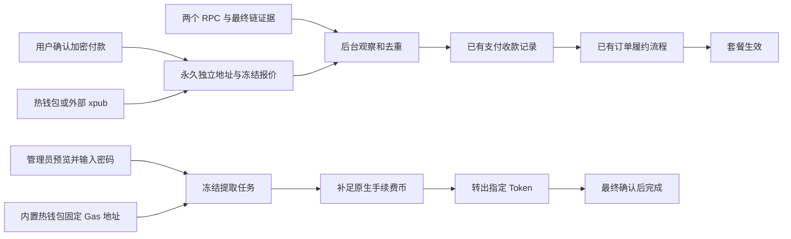

# 加密货币订单收款与资产管理

当前实现版本：**0.37.0** · 文档更新：2026-10-09。

本版在 0.36.0 钱包基础上交付 Ethereum 和 BNB Smart Chain 的套餐订单付款：用户选择加密货币并确认网络、币种后，服务器分配独立地址；后台核对最终转账后，通过现有订单履约流程自动开通套餐。管理员可以查询历史地址余额、向固定 Gas 地址补充原生币，并预览、批准和跟踪热钱包 Token 提取任务。浏览器关闭不影响后台处理。

“代码已实现”“隔离测试通过”和“正式网络已验收”是不同结论。当前验证记录见 [VALIDATION.md](VALIDATION.md)；本轮无 fork Anvil 的收款、自动开通、Gas 和 Token 提取真实 EVM 执行已通过；它不构成主网或 L2 运营验收。

## 文档职责

| 文档 | 用途 |
| --- | --- |
| 本文 | 当前交付、网络边界、模块责任和后续计划 |
| [CONTRACTS.md](CONTRACTS.md) | 0.37.0 实际 HTTP 接口、字段、权限与界面状态 |
| [VALIDATION.md](VALIDATION.md) | 已执行测试、证据范围、待验证项目与发布门槛 |
| [订单收款与资产归集](../../CRYPTO_TREASURY.md) | 用户付款、Gas 资金和管理员提取的业务规则 |
| [钱包管理](../../CRYPTO_WALLETS.md) | 创建、外部 xpub、备份、恢复和索引高水位 |
| [完整技术设计](../../CRYPTO_PAYMENTS.md) | 长期架构与更广的资金不变量；其中未落地的模型不能作为本版接口或交付声明 |
| [构建来源](../../CRYPTO_BUILD.md) | Wallet Core、go-ethereum、来源归档与重建方式 |

发生差异时，应先核对目标版本代码并修正文档。本版实际接口以 CONTRACTS 和对应实现为准，不把早期设计中的 `/bindings`、独立 funding/outbox 或退款接口当成已存在能力。

## 当前交付

| 能力 | 0.37.0 行为 |
| --- | --- |
| 内置热钱包 | 官方 Trust Wallet Core 4.8.4 浏览器 WASM 生成，Go 独立校验，服务器 Vault 加密保管；运行中的面板具有签名能力 |
| 外部 xpub | 校验 EVM 分支、派生独立订单地址、自动核对收款、查询余额；面板没有私钥，不能后台签署提取 |
| 永久地址 | 手动地址和订单地址均保留索引记录；付款单取消、过期、完成或切换网络后不回收、不重新分配 |
| 套餐付款 | 仅在用户确认加密付款时创建 invoice 与地址；普通下单、打开页面、免费套餐、余额或法币付款不分配 crypto 地址 |
| 报价 | 人民币套餐价格换算为指定资产原子数量；管理员手动设置汇率与有效期，已建付款单保存原报价 |
| 认款与开通 | 核对网络、合约、完整 receipt、规范区块和最终确认；少付可补足，及时上链但稍后确认仍按区块时间处理；订单最多开通一次 |
| 异常款 | 错链、错币、晚付、取消后到账及额外款保留转账证据；不因此冒充已开通或已退款 |
| 成员界面 | 内嵌付款、交易所纯地址 QR、钱包付款 QR、准确剩余数量、刷新恢复、付款与套餐状态分开显示 |
| 管理员记录 | 只读查看成员付款单、链上转账证据、地址关联订单和分链余额；未知资产保留原子数量与合约信息 |
| 热钱包提取 | 按网络、币种、地址余额阈值、可选地址集合和目标地址预览；密码批准冻结报价，后台补 Gas、发送 Token 并等待最终确认 |
| 任务恢复 | 广播前持久化签名交易、哈希和 nonce；不确定结果复查或重播原交易；支持有条件重试和安全结束任务 |
| 备份与持久化 | 钱包备份、完整数据库快照、地址高水位、付款记录、链状态和资金任务纳入对应存储与完整性检查 |

原有零元套餐、余额、易支付、Stripe、套餐叠加/恢复规则与法币退款功能保留。crypto 目前只购买套餐，不提供成员加密充值或成员提币功能。

## 网络与资产边界

| 网络 | 本版自动收款与热钱包提取 | 余额查询 | 当前资产清单 |
| --- | --- | --- | --- |
| Ethereum，Chain ID 1 | 可由管理员配置后启用 | 支持 | USDT、原生 USDC，均 6 位精度 |
| BNB Smart Chain，Chain ID 56 | 可由管理员配置后启用 | 支持 | Binance-Peg USDT、USDC，均 18 位精度 |
| Arbitrum One，42161 | **代码强制关闭** | 配置有效 RPC 后可查询 | USDT0、原生 USDC |
| OP Mainnet，10 | **代码强制关闭** | 配置有效 RPC 后可查询 | USDT0、原生 USDC |
| Base，8453 | **代码强制关闭** | 配置有效 RPC 后可查询 | 原生 USDC；不假设存在 Base USDT |

L2 尚未完成 L1 最终性证据与完整费用模型验收，不能通过界面勾选或修改 `finality_verified` 绕过限制。清单中存在一个资产不等于它可收款。

Ethereum/BSC 使用两个独立 RPC 配置并核对链证据；正式供应商与真实资产仍需运营环境验收。本版签名是 **EIP-155 legacy 交易**，按双 RPC 的 Gas price 和 estimateGas 结果估算并留有限余量，不宣称已交付 EIP-1559 type-2 或 L2 的 L1 数据费用适配。Token 与原生手续费币分账显示，不跨链相加、不自动兑换。

## 业务流程与资金边界

收款地址与固定 Gas 资金地址使用不同用途分支。ETH 和 BNB 分属各自网络；即使地址字符串相同，其他链余额也不能支付本链手续费。资金地址既承担补入订单地址的差额，也承担补款交易自身的手续费。

外部 xpub 的转出由持有私钥的外部钱包完成。内置热钱包不应被称为冷钱包或独立信任边界的签名器；产品保留“小额存放、定期转走”的说明。钱包助记词备份不能替代完整数据库和对应 `master.key`，运行中迁移还必须保留 invoice、扫描进度、原签名交易和 nonce 记录。

一期只支持一个付款权威站点使用一个收款分支。本库可以拒绝重复分支，无法对两个互不相通的部署强制全局独占；不得把同一 xpub 分支交给多个独立站点同时分配。Pro 子站挂载不构成多站共享收款池。

## 实际代码与存储责任

| 模块 | 已实现责任 |
| --- | --- |
| `crypto_hd.go`、`crypto_wallet*.go` | 公开向量校验、HD 派生、钱包模式、手动地址、加密备份、恢复与高水位 |
| `crypto_payments.go`、`crypto_invoices.go` | 固定链/资产配置、手动汇率、精确报价、权限、事务分配、invoice 和详情 |
| `crypto_evm.go`、`crypto_scanner.go` | RPC 一致性、观察/最终证据、规范 receipt、去重、历史补扫和链冻结 |
| `payment_receipts.go`、`commerce_orders.go` | 复用已有收款记录、后台恢复和套餐履约；保持跨渠道订单归属约束 |
| `crypto_signing.go`、`crypto_sweep*.go` | 固定 Gas 地址、余额、冻结报价、幂等任务、执行租约、原始签名交易、广播和确认 |
| `crypto_payment_integrity.go`、持久层快照 | 新资金关系、索引与任务记录的完整性检查和快照纳入 |
| `CryptoOrderPayment.vue`、`CryptoPaymentSettings.vue`、`CryptoTreasury.vue` | 成员付款、管理员收款配置、余额/Gas/提取与移动端界面 |

014 迁移交付钱包基础；015 迁移新增付款配置、invoice、扫描链游标、观察/最终转账、链冻结、Gas 地址、提取任务、任务项与持久签名交易。后续修改继续使用新迁移，不能改已发布迁移的 checksum。正式字段以迁移文件和实际 Go DTO 为准。

## 仍未交付的能力与技术债

| 范围 | 当前边界与后续施工 |
| --- | --- |
| 链上退款 | 未实现自动原路退款、部分退款、超付款退款分账或退款转出凭证核销。已有退款申请/审批不等于可执行 crypto 退款；不能用法币“人工确认退款”绕过此限制 |
| OKX/其他钱包连接 | 未实现身份绑定、挑战签名或自动读取 xpub；用户付款无需连接钱包，普通钱包连接不赋予 HD 权限 |
| 独立签名器 | 目前为服务器托管热钱包；受限外部签名器、硬件钱包、MPC、多签和独立密钥信任边界留待后续 |
| 多站共享地址 | 未实现跨部署中心 claim、分支预留服务和全局高水位协调；不能把本站唯一键宣传为跨站唯一性 |
| 实时汇率 | 无市场汇率服务、自动脱锚控制或自动兑换；只有管理员手动汇率与到期控制 |
| 统一支付内核 | 当前复用既有支付/履约链路并补充 crypto 边界；早期设计中的独立 `order_fundings`、通用资金责任账和统一 outbox 重构不应标记为全部完成 |
| 资产与费用扩展 | 不支持任意自定义 Token、原生币套餐付款、Token 自动兑换、原生币余额清扫、跨链桥或 L2 自动资金操作 |
| 扫描与大规模资金运营 | 继续完善历史扫描吞吐、观测/告警、人工对账工具和长周期恢复演练；本版单次全部地址预览限制为 1000，超过时需明确选择地址，不静默截断 |
| 正式运营证明 | 双 RPC fixture 和无价值 EVM 不能代替每条正式网络的供应商、合约、最终性、真实手续费与首单净到账验收 |

## 后续施工顺序

保留原 CP 路线作为长期计划，但按已实现范围拆分验收，不以钱包或界面完成代替整项验收。

1. **CP-001/003/004/006/007/009 当前切片**：精确金额、持久地址、ETH/BSC 扫描、invoice、收款与成员界面已经落地；持续补齐故障、独立进程和完整恢复证据。
2. **CP-008 当前切片**：热钱包 Gas 与 Token 归集已落地；退款责任、部分退款和链上退款凭证仍独立待做。
3. **CP-010/011**：在已通过的本地 Anvil 闭环基础上，完成最终全仓检查、安装升级和逐链运营验收，再按批准范围启用真实资产；记录限额首单至归集净到账的证据。
4. **CP-002 支付内核重构**：统一付款归属应用服务、资金责任账和持久履约事件，覆盖所有渠道竞争与退款准入，不破坏既有套餐逻辑。
5. **CP-005 与后续扩展**：按需实施 OKX 身份绑定、隔离签名器、L2 最终性/费用、实时汇率与多站资金协调。每项独立设计和验收，不能依赖普通钱包连接自动获得这些能力。
