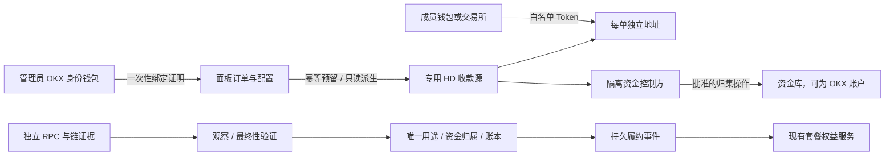

# 加密钱包与后续支付项目

文档版本：1.1 · 2026-10-08。支付内核审计基线：广月面板 **0.35.1**，`27eacf9323c6f0ab9a5f1ecd2c45ed48140c005f`；当前增量为钱包与地址管理。

当前交付内置热 HD 钱包、外部 xpub、手动地址分配、备份恢复和停用管理。创建使用官方 Trust Wallet Core 4.8.4 浏览器 WASM，Go 独立验证、恢复加密备份与派生；热钱包助记词由 Vault 加密存储。钱包查看与备份操作要求当前管理员密码，不进入普通响应、日志或幂等缓存。使用方法见[钱包管理](../../CRYPTO_WALLETS.md)。

链扫描、链上订单支付、自动套餐开通、自动归集、链上退款和 OKX 身份绑定仍未实现。本文后续付款任务继续保留，不能因钱包管理已交付就标记整个 crypto 项目完成。

## 阅读顺序与文档职责

| 文档 | 内容 |
| --- | --- |
| 本文 | 产品范围、现状、架构决策、施工依赖、技术债与待决事项 |
| [接口与交互契约](CONTRACTS.md) | 钱包绑定、地址分配、付款单、权限、错误和 UI 状态 |
| [验证与交付计划](VALIDATION.md) | fixture、并发、崩溃恢复、跨数据库、验收证据和发布门槛 |
| [完整技术设计](../../CRYPTO_PAYMENTS.md) | 精确资产白名单、金额公式、链最终性、逻辑 SQL、收款与退款不变量 |

完整技术设计决定资金规则，本项目文档补充工程落地；接口路径和状态以本项目契约为准。文档发生冲突时先修订并评审，不允许开发者自行放宽确认、去重或资金控制条件。

## 当前交付与后续支付目标

| 能力 | 当前状态 |
| --- | --- |
| 内置热钱包 | 官方浏览器 WASM 生成 24 词，后台独立核对并 Vault 加密；仅建议小额且定期转走 |
| 外部 xpub | 导入兼容的 EVM 收款分支，服务端校验并只读派生；不索取外部钱包私钥 |
| 地址分配 | 本站数据库事务锁、请求幂等与索引高水位；全部是手动地址，尚无订单关联 |
| 备份与恢复 | 独立口令加密备份；同分支合并保留较高索引，新站恢复暂停并要求明确核对索引 |
| 资金转出 | 管理员二次认证可临时查看助记词，用兼容外部工具手动转出；面板内不广播交易 |
| 收款、支付与归集 | 待实施；不显示 crypto 支付渠道已启用，不因生成地址开通套餐 |

生产无需 Node 运行时或钱包侧车。约 10.39 MB 的官方 WASM 随本站安装包按需加载；官方 loader 的来源、内容哈希和许可在 `licenses/trust-wallet-core-source.json` 固定。恢复旧备份无法自动知道外部更高的索引，同一分支不能同时由两个独立站点分配；完整数据库备份和对应 `master.key` 也需保全。

以下是后续链上支付目标：

管理员选择内置热钱包或可验证的外部 HD 收款源，完成未来逐链验收后开启指定网络/资产。此后套餐订单自动分配独立地址，最终确认后自动开通；成员不必连接钱包。OKX 绑定将作为独立的可选身份/资金库功能，不是本期使用内置钱包的前置条件。断线、重复通知、重启与重试不能重复收款、分配地址或开通套餐。

首期只支付已有套餐订单，保留现有零元套餐、余额、易支付、Stripe 和退款审批能力。加密充值、兑换、提现、自动跨链桥与支付路由合约留待后续项目。上线时默认停用，逐链、逐资产明确启用。

网络范围沿用技术设计：Ethereum、BNB Smart Chain、Arbitrum One、OP Mainnet、Base。推荐 Base 原生 USDC、BNB Binance-Peg USDT；Base 不推测配置 USDT。首个可运行开发闭环只使用离线 fixture 与无价值测试链，不能把测试结果写成主网收款已验收。

## 已核验的代码基础

| 当前能力 | 真实实现与复用边界 |
| --- | --- |
| 法币收款唯一性 | [payment_receipts.go](../../../backend/internal/controlplane/payment_receipts.go)：`recordPaymentEvent`，本站 `account_scope + external_ref` 唯一收款、冲突回读和异常款留存 |
| 后台恢复 | 同文件 `reconcilePaymentReceipt / paymentWork / runPaymentWorker`：收款先持久化、后台恢复开通；不是只靠回调临时处理 |
| 套餐权益 | [commerce_orders.go](../../../backend/internal/controlplane/commerce_orders.go)：`fulfilOrder`，保留旧套餐剩余时间、子站结算、权益切换规则 |
| 余额与请求幂等 | [commerce_types.go](../../../backend/internal/controlplane/commerce_types.go)：`commerceReplay / saveCommerceRequest / postMoney`，CNY 分与平衡分录；Token 原子数量单独建模 |
| 渠道与配置快照 | [payment_core.go](../../../backend/internal/controlplane/payment_core.go)：`attemptProvider / paymentAccountScope`，复用加密快照、停用与历史处理语义 |
| 退款审批 | [payment_refunds.go](../../../backend/internal/controlplane/payment_refunds.go)：管理员二次认证与法币退款；不能直接表达部分链上退款及多款责任 |
| 持久层 | [persistence](../../../backend/internal/persistence/db.go)：SQLite WAL/单连接与 Pro PostgreSQL 站点 schema；Redis 不作为资金事实来源 |
| 前端入口 | [PaymentSettings.vue](../../../frontend/src/components/PaymentSettings.vue)、[OrdersPage.vue](../../../frontend/src/pages/OrdersPage.vue)：沿用交易设置与我的订单，新增内部组件 |

## 后续支付架构与决策

| 决策 | 约定与原因 |
| --- | --- |
| ADR-01 钱包连接不等于 HD 权限 | 普通 OKX Provider 没有可假定使用的 xpub 导出接口。先验收 EVM EOA 绑定；智能账户需独立签名校验适配器，MPC 账户不得推定为 BIP-32 钱包 |
| ADR-02 两种钱包模式 | 当前默认内置热 HD 钱包（官方 WASM 生成、Vault 加密）；保留专用分支 xpub。受限隔离 HD 服务是后续扩展。禁止使用认证签名生成种子 |
| ADR-03 收款与资金库分开 | 独立 HD 服务地址属于该收款钱包。OKX 绑定不赋予它支出订单地址资金的能力；地址派生、归集、退款分别控制 |
| ADR-04 单一收款权威 | 一期每个收款分支只服务一个付款权威站点，不支持各站共享同一分支。Pro 子站挂载不产生第二份付款。不同 schema 的唯一键不能冒称跨站全局去重；共享场景需另做中心 claim 服务 |
| ADR-05 所有渠道同一订单归属 | 余额、易支付、Stripe、crypto 竞争同一订单资金归属。免费开通不创建 crypto invoice，权益操作仍须幂等 |
| ADR-06 不复用地址 | 到期、取消、服务预留但本站提交失败的地址仍永久占用；从旧备份恢复须核对外部分配高水位 |
| ADR-07 最终确认才开通 | 逐链策略，L2 核验 L1 依据；不提供默认的低确认秒开。提交 tx hash、签名通知、回跳都只是提示 |
| ADR-08 沿用本地交易请求域 | 管理接口统一 `/api/commerce/crypto/admin/*`。复用前端 commerce 的本地请求范围，后端独立强制管理员鉴权及禁止子站代理资金操作 |

“隔离”要求独立的密钥信任边界；同一主机、同一 root 权限下换一个进程或容器不能被宣传为抵抗面板主机失陷。外部 xpub 模式的备份和转出由资金控制方管理，面板保存只读描述符。内置热模式明确由服务器托管助记词密文，不能称为隔离签名器；只存小额并定期转走。

## 模块与数据责任

| 模块（拟新增） | 输入 / 输出 | 责任 |
| --- | --- | --- |
| `payments/crypto/amounts`、`assets` | CNY 分、汇率有理数、Token 原子数量 | 任意精度运算、合约白名单、不可变报价；与 CNY `money()` 分开 |
| `wallet_bindings` | 账户、一次性挑战、签名 | 证明特定用途的账户控制，单次消费挑战；不导出密钥、不签资金交易 |
| `address_pools` | 分支描述符或受限服务、幂等请求 | 本地索引事务或外部持久预留，唯一池所有者、恢复高水位 |
| `observer`、逐链 `finality` | 区块、完整 receipt、RPC quorum | 区分观察和最终事实，重组时替换整份规范 receipt |
| `settlement` | 后台验证的最终证据 | 资金用途 claim、Token 账本、订单 funding、outbox 原子提交 |
| 现有 `controlplane` 服务 | funding 与履约事件 | 在同一业务事务内复用套餐开通/撤销，处理旧套餐及子站结算 |
| `refunds`、`signer_client` | 已批准责任、受限任务、最终转出事实 | 本金与额外款分开，退款/归集凭证只核销一次 |

新包不能导入 `controlplane` 造成循环依赖。使用小范围端口连接既有事务、时钟、地址服务与 RPC；资金事务仍由付款权威数据库管理。网络请求不持有面板全局锁或长数据库事务。

本期钱包使用 014 增量迁移，新增钱包、地址、操作幂等及状态记录，并纳入快照与完整性检查。后续支付选择当时可用的增量序号，不改历史 checksum。技术设计第 7 节的支付 SQL 仍是逻辑草案，还需补齐绑定挑战、池/分支版本、预留、恢复 checkpoint、资金责任与任务记录，验证复合外键与快照导入顺序，不能将草案视为已经执行的迁移。

## 技术债与整改要求

| 编号 | 问题 | 施工要求 |
| --- | --- | --- |
| TD-01 | 尚无 `order_fundings` 独立模型 | 先提取统一付款归属服务，覆盖所有渠道和退款准入；历史已开通订单映射必须可核对，冲突不能猜测胜者 |
| TD-02 | `commerce_outbox` 只有表，无生产入队/消费者 | 实现持久事件、确定业务键、消费幂等、重启恢复及最终履约前复核 |
| TD-03 | `confirmExternalOrder` 用 `httptest` 调 handler | 提取 `orderAction` 的应用服务；HTTP、回调和 worker 共用同一服务，不复制开通逻辑 |
| TD-04 | 15 分钟订单窗和回调入库时间 | crypto 付款窗独立，按规范区块时间判断及时付款；及时上链后确认延迟继续处理 |
| TD-05 | `int64` 及 receipt 单笔全额退款 | Token 使用规范十进制字符串/任意精度；建立本金、超付、晚付责任和按资产的部分退款预留 |
| TD-06 | 快照/账目检查未覆盖新关系 | 新表按外键顺序加入 `snapshot.Tables`；核对 claim、funding、Token 分录、退款与已消费事件 |
| TD-07 | 多实例测试共用 Store、SQLite 单连接 | 增加独立连接/独立进程与真实 PostgreSQL 测试，不能只用同一个 App 锁证明数据库唯一性 |
| TD-08 | 前端付款仅有 `redirect` | 新增 `crypto_preparing / crypto_invoice` 分支；选择 crypto 不开外部空弹窗，刷新接续持久请求或恢复当前/最近付款单 |
| TD-09 | 支付方式未明确订单/充值能力 | 增加 `purposes`，crypto 一期仅 `order`；钱包充值页不能错误开放它 |
| TD-10 | 人工凭据确认退款 | crypto tx hash 只触发验证，核对真实转出、最终性及唯一凭证后才能完成退款 |

## 施工任务与依赖

状态只反映实际完成情况。CP-000 文档完成；钱包切片 CW-001 已交付内置热钱包、外部 xpub、手动地址及备份恢复，并有独立验证。以下 CP 任务是完整链上支付路线，钱包切片仅实现其中一部分 HD 基础，不代表 invoice、scanner 或结算任务完成。

| 任务 | 对应技术阶段 | 交付物与完成条件 | 前置 |
| --- | --- | --- | --- |
| CP-000 项目文档 | 设计 | 现状、接口、交互、验证和决策记录；本次完成 | 无 |
| CP-001 测试与领域契约 | P1 准备 | 合成 fixture、可控时钟、金额/证据类型、失效场景与数据库断言 | CP-000 |
| CP-002 统一支付内核 | P0 | 付款应用服务、跨渠道 funding、履约 outbox 与消费记录；法币回归通过 | CP-001 |
| CP-003 金额和增量存储 | P1 | 精度、报价、责任账、增量迁移与完整性检查；SQLite/PG 等价 | CP-002 |
| CP-004 HD 地址分配 | P2 | pool adapter、本地派生/外部预留、分支独占和恢复演练；不复用地址 | CP-001、CP-003 |
| CP-005 钱包配置向导 | P2 | OKX EOA 绑定挑战、收款源配置状态、后台能力检查；未配置不发 invoice | CP-004 |
| CP-006 链观察与最终性 | P1/P2 | 离线 RPC、完整 receipt、重组、游标与逐链策略；分歧停止结算 | CP-003 |
| CP-007 收款与订单闭环 | P2 | invoice、唯一用途、Token 账本、funding、发货事务；并发/崩溃可恢复 | CP-002、CP-004、CP-006 |
| CP-008 售后与资金转出 | P2/P3 | 本金/额外款、批准退款、人工或受限归集、Gas预算；无价值环境闭环 | CP-007 |
| CP-009 完整成员交互 | P2 | 内嵌付款、刷新恢复、少付/超付/延迟状态、双语与移动端验收 | CP-005、CP-007、CP-008 |
| CP-010 升级与运维 | P3 准备 | 快照/备份、高水位、修复/重扫、停用开关、监控和恢复操作手册 | CP-007、CP-008 |
| CP-011 逐链受控启用 | P3/P4 | 配置真实供应商后逐链验收，再限额收款；生成完整证据 | CP-009、CP-010 |

CP-001 的领域/fixture 工作可与 CP-002 的方案提取并行。CP-004/CP-006 的接口稳定后可并行开发。真实资产启用必须等待资金转出、恢复和全链路验收，不能用 UI 完成度替代。

## 需要落实的外部能力

| 项目 | 推荐默认值 | 当前状态 |
| --- | --- | --- |
| HD 钱包与控制方 | 当前内置热钱包或外部 xpub；后续扩展独立信任边界的服务配对 | 官方 Wallet Core 4.8.4 浏览器 WASM 与 Go 独立派生已接入；隔离服务待实施 |
| 可选钱包身份绑定 | OKX EVM EOA；显式能力不足时说明原因 | 待开发及实际兼容性验证，不阻塞本期内置钱包使用 |
| RPC 与 L2 批次证明 | 独立供应商 quorum；可靠 finalized 语义及 L1 依据 | 尚未配置和链上验收 |
| 挑战/付款窗口 | 挑战 5 分钟单次使用；钱包 30 分钟、交易所 60 分钟 | 规范默认值，未实现 |
| 晚付自动恢复 | 默认关闭；管理员以后批准有界策略并冻结到报价 | 设计已定义 |
| 归集与退款自动化 | 首期须可安全人工/受限执行，自动化规模扩展放 P5 | 待资金控制能力验收 |

后续付款开发从 **CP-001 + CP-002** 继续：证明链证据/幂等约束、提取现有付款业务服务，再把全部渠道接入统一资金归属。本期钱包不能绕过这些条件开放加密货币付款入口。
